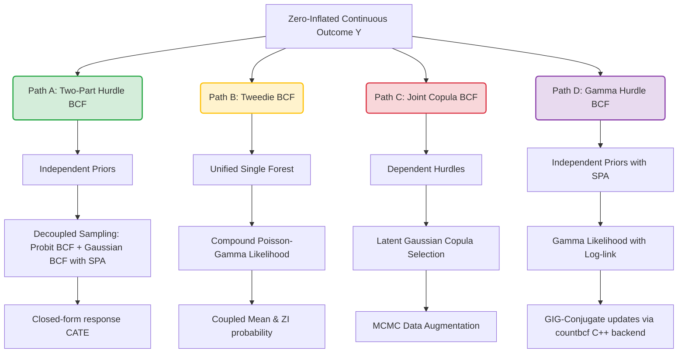

# Zero-Inflated Continuous BCF (ZIC-BCF): Methodological Projections & Estimation Strategies

Zero-inflated continuous data (often termed **semicontinuous data**) are characterized by a discrete point mass at exactly zero alongside a highly skewed, strictly positive continuous distribution. Examples abound in causal research:
- **Health Economics:** Individual medical expenditures (many patients record $\$0$ because they do not use care; users have right-skewed, positive healthcare costs).
- **Nutritional Epidemiology:** Consumption levels of episodically eaten foods (zero on non-consumption days, skewed positive amounts on consumption days).
- **Environmental Science & Climatology:** Daily precipitation amounts (zero on dry days, positive millimeters of rain on wet days).

When estimating heterogeneous treatment effects on such outcomes, standard continuous Bayesian Causal Forests (BCF) fail because they assume Gaussian errors, leading to boundary bias near zero, negative predictions, and poor uncertainty intervals. 

This proposal structures your research idea into a cohesive methodological framework. It details **four potential paths** of varying complexity, showing how we can extend the treatment-aware $(\mu, \tau)$ decomposition of BCF to zero-inflated continuous data.

---

## 1. Mathematical Framework and Setup

Let:
- $Y_i \ge 0$ be the observed semicontinuous outcome for unit $i \in \{1, \dots, N\}$.
- $Z_i \in \{0, 1\}$ be the binary treatment indicator.
- $X_i$ be a $P$-dimensional vector of baseline covariates.
- $\widehat{\pi}_i = \widehat{\pi}(X_i)$ be the estimated propensity score on the full sample, used to mitigate **Regularization-Induced Confounding (RIC)** in the participation (hurdle) stage.
- $\widehat{\pi}^+_i = \widehat{\pi}(X_i \mid I_i = 1)$ be the estimated propensity score on the active (positive) subpopulation. Since selection into the active subset is a collider, the treatment-assignment mechanism within this subpopulation differs from the full sample. Utilizing this **Subpopulation Propensity Adjustment (SPA)** prevents selection-induced RIC bias in the continuous intensity stage.

We decompose the observed outcome $Y_i$ into a two-part mixture:
$$Y_i = I_i \cdot Y_i^+$$
where:
1. $I_i = \mathbb{I}(Y_i > 0) \in \{0, 1\}$ is a binary indicator representing **participation** (i.e., whether the outcome is positive vs. zero).
2. $Y_i^+ = Y_i \mid Y_i > 0$ is a continuous positive random variable representing **intensity** (i.e., the continuous magnitude conditional on participation).

---

## 2. Proposed Methodological Paths

We propose four distinct paths to explore for this goal. They are ranked by complexity, implementation feasibility, and methodological promise.

### Path A: Two-Part Hurdle BCF (ZIC-BCF) with SPA — *Highly Recommended*

This path extends the classical two-part hurdle model (Olsen & Schafer, 2001; Tooze et al., 2002) using two separate BCF specifications. Because the joint likelihood factors under prior independence, this model is **mathematically elegant, robust, and exceptionally simple to implement**. We introduce **Subpopulation Propensity Adjustment (SPA)** to ensure that Regularization-Induced Confounding (RIC) is correctly mitigated in both the hurdle and continuous stages.

#### Likelihood and Model Specifications
We specify independent BCF structures for the binary hurdle and the log-intensity:

1. **Part 1: The Binary Hurdle (Probit BCF)**
   $$P(I_i = 1 \mid X_i, Z_i) = \Phi\left( \eta_{b}(X_i, Z_i) \right)$$
   where $\Phi(\cdot)$ is the standard normal cumulative distribution function (CDF), and the latent utility is decomposed as:
   $$\eta_{b}(X_i, Z_i) = \mu_b(X_i, \widehat{\pi}_i) + Z_i \cdot \tau_b(X_i)$$
   - $\mu_b(X_i, \widehat{\pi}_i)$ is a prognostic forest modeling control participation odds, using the full-sample propensity score $\widehat{\pi}_i$ to control for RIC.
   - $\tau_b(X_i)$ is a moderating forest modeling treatment effect on participation.

2. **Part 2: The Continuous Intensity (Log-Normal BCF with SPA)**
   For units with $I_i = 1$, we model the log-transformed positive outcome:
   $$\log(Y_i^+) = \eta_{c}(X_i, Z_i) + \epsilon_i, \quad \epsilon_i \sim \mathcal{N}(0, \sigma^2)$$
   where the log-mean is decomposed as:
   $$\eta_{c}(X_i, Z_i) = \mu_c(X_i, \widehat{\pi}^+_i) + Z_i \cdot \tau_c(X_i)$$
   - $\mu_c(X_i, \widehat{\pi}^+_i)$ is a prognostic forest modeling the control-group log-outcome. **Crucially, we use the active-subset propensity score $\widehat{\pi}^+_i = \widehat{P}(Z_i=1 \mid X_i, I_i=1)$** instead of the full-sample propensity score $\widehat{\pi}_i$. Because selection into the active subset ($I_i=1$) is a collider, the treatment assignment mechanism in this subpopulation is altered. Utilizing $\widehat{\pi}^+_i$ (SPA) guarantees proper RIC mitigation on the selected sample.
   - $\tau_c(X_i)$ is a moderating forest modeling treatment effect on the log-outcome.
   - $\sigma^2$ is the residual error variance of the positive part.

#### Posterior Factorization and Decoupled Sampling
Under independent priors for the binary parameters $\boldsymbol{\theta}_b = \{\mu_b, \tau_b\}$ and continuous parameters $\boldsymbol{\theta}_c = \{\mu_c, \tau_c, \sigma^2\}$, the joint posterior factors completely:
$$p(\boldsymbol{\theta}_b, \boldsymbol{\theta}_c \mid Y, I, X, Z) = p(\boldsymbol{\theta}_b \mid I, X, Z) \cdot p(\boldsymbol{\theta}_c \mid Y^+, I = 1, X, Z)$$

This leads to a highly efficient MCMC strategy:
- **Step 1:** Fit a probit BCF model on the binary vector $I \in \{0, 1\}$ using the full sample. This yields $S$ posterior draws of $\{\mu_b^{(s)}, \tau_b^{(s)}\}$.
- **Step 2:** Fit a standard Gaussian continuous BCF model on $W = \log(Y)$ **only using the active subset of observations** where $I_i = 1$. This yields $S$ posterior draws of $\{\mu_c^{(s)}, \tau_c^{(s)}, \sigma^{2(s)}\}$.

#### Causal Estimands and Response-Scale Re-Transformation
To obtain treatment effects on the original dollar or physical unit scale, we combine the two components. For each posterior draw $s \in \{1, \dots, S\}$ and unit $i$:

1. **Control Potential Outcome Mean:**
   $$\mu_0^{(s)}(X_i) = \Phi\left( \mu_b^{(s)}(X_i, \widehat{\pi}_i) \right) \cdot \exp\left( \mu_c^{(s)}(X_i, \widehat{\pi}^+_i) + \frac{\sigma^{2(s)}}{2} \right)$$
2. **Treated Potential Outcome Mean:**
   $$\mu_1^{(s)}(X_i) = \Phi\left( \mu_b^{(s)}(X_i, \widehat{\pi}_i) + \tau_b^{(s)}(X_i) \right) \cdot \exp\left( \mu_c^{(s)}(X_i, \widehat{\pi}^+_i) + \tau_c^{(s)}(X_i) + \frac{\sigma^{2(s)}}{2} \right)$$
3. **Conditional Average Treatment Effect (CATE) on the Response Scale:**
   $$\tau_{\text{resp}}^{(s)}(X_i) = \mu_1^{(s)}(X_i) - \mu_0^{(s)}(X_i)$$
4. **Average Treatment Effect (ATE):**
   $$\text{ATE}^{(s)} = \frac{1}{N}\sum_{i=1}^N \tau_{\text{resp}}^{(s)}(X_i)$$

#### Pros & Cons
> [!TIP]
> **Advantages:**
> - **Zero C++ modification required:** Since the posteriors factor, you can implement this immediately in R using existing, highly optimized packages (like `bcf` or `dbarts`) by writing a simple R wrapper.
> - **Flexible Covariate Control:** Decoupling allows covariates to have completely different effects (or even split variables) on participation vs. intensity.
> - **Numerical Stability:** Completely avoids the computational instability of joint multivariate tree updates.
>
> **Disadvantages:**
> - Assumes that the residual error terms of the binary selection process and the continuous intensity process are independent (no selection on unobservables).

---

### Path B: Unified Single-Forest Tweedie-BCF

Tweedie distributions are a family of exponential dispersion models where the variance is proportional to a power $p$ of the mean: $\text{Var}(Y) = \phi \mu^p$. When the power index lies in $1 < p < 2$, the Tweedie distribution acts as a **compound Poisson-Gamma process** (a Poisson number of independent Gamma draws), generating a discrete point mass at zero and a continuous positive support.

#### Model Specification
Instead of a two-part hurdle, we write a single unified treatment-aware BCF decomposition for the Tweedie mean parameter $\mu_i$:
$$Y_i \mid X_i, Z_i \sim \text{Tweedie}(\mu_i, \phi, p), \quad 1 < p < 2$$
$$\log \mu_i = \mu_f(X_i, \widehat{\pi}_i) + Z_i \cdot \tau_f(X_i)$$
where:
- $\mu_f$ is a prognostic forest.
- $\tau_f$ is a moderating forest (representing the conditional treatment log relative rate).

The probability of obtaining a zero is intrinsically coupled to the mean:
$$P(Y_i = 0 \mid X_i, Z_i) = \exp\left( -\frac{\mu_i^{2-p}}{\phi (2-p)} \right)$$

#### Pros & Cons
> [!WARNING]
> **Advantages:**
> - **Unified Likelihood:** Replaces two separate models with a single elegant parametric family, allowing joint likelihood inference.
> - **Self-Bounded Support:** Support is naturally restricted to $[0, \infty)$ without artificial transformations.
>
> **Disadvantages:**
> - **Rigid Mean-Zero Coupling:** The probability of a zero is mathematically locked to the mean. If treatment increases the intensity of positive values but does not attract new participants, a Tweedie model cannot easily accommodate this.
> - **Complex MCMC updates:** The Tweedie density has no closed-form expression (it requires series expansions or Fourier inversion). Leaf parameter updates and tree proposals would require complex C++ Metropolis-Hastings steps, mirroring the latent Poisson-Gamma auxiliary variables.

---

### Path C: Joint Copula-BCF with Selection on Unobservables

If there are unobserved factors that simultaneously affect both whether an individual participates and the intensity of their outcome (e.g., highly motivated patients are more likely to seek treatment *and* spend more on care), then the independent hurdle model of Path A yields biased estimates of the continuous treatment effect. Path C addresses this selection bias by modeling the joint dependency through a **copula or latent Gaussian correlation (Heckman-style Selection model)**.

#### Model Specification
Let $W_i^*$ be a latent continuous participation utility, and $Y_i^{*+}$ be the latent log-intensity:
$$\begin{aligned}
W_i^* &= \mu_b(X_i, \widehat{\pi}_i) + Z_i \cdot \tau_b(X_i) + \delta_i \\
\log(Y_i^{*+}) &= \mu_c(X_i, \widehat{\pi}_i) + Z_i \cdot \tau_c(X_i) + \epsilon_i
\end{aligned}$$
where the error terms are coupled via a bivariate normal distribution:
$$\begin{pmatrix} \delta_i \\ \epsilon_i \end{pmatrix} \sim \mathcal{N}\left( \begin{pmatrix} 0 \\ 0 \end{pmatrix}, \begin{pmatrix} 1 & \rho\sigma \\ \rho\sigma & \sigma^2 \end{pmatrix} \right)$$
The observed variables are:
- $I_i = \mathbb{I}(W_i^* > 0)$
- $\log Y_i = \log(Y_i^{*+})$ only if $I_i = 1$ (otherwise missing or zero).

#### Pros & Cons
> [!CAUTION]
> **Advantages:**
> - **Selection Bias Correction:** Uniquely models the correlation $\rho$ between the selection process and the outcome process, correcting for selection on unobservables.
>
> **Disadvantages:**
> - **High Computational Complexity:** Requires a complex C++ MCMC sampler that performs data augmentation on the latent utilities $W_i^*$ for all censored observations, combined with joint covariance sampling of $(\rho, \sigma^2)$ and tree adjustments.
> - **Weak Identification:** Without an exclusion restriction (an instrumental variable that affects selection $I_i$ but has no direct effect on the intensity $Y_i^{*+}$), the correlation $\rho$ is notoriously hard to identify, leading to wide posteriors and MCMC mixing issues.

---

### Path D: Gamma Hurdle BCF via GIG Conjugacy — *Highly Promising Breakthrough*

While Path A uses a Log-Normal model for the continuous component, semicontinuous outcomes (e.g., medical costs) often exhibit a standard deviation that scales linearly with the mean ($Var(Y^+) \propto \mathbb{E}[Y^+]^2$). A **Gamma regression model with a log-link** is the standard econometric choice for such data. 

Traditionally, implementing a Gamma BART/BCF with a log-link requires complex Metropolis-Hastings updates because the leaf parameters are not conjugate. However, we propose a **mathematical breakthrough** that maps the Gamma continuous intensity model directly onto the **GIG-mixture conjugate leaf updates** of Murray's Log-linear BART (2021) and your existing `countbcf` package.

#### Model Specification
For active units ($I_i = 1$), we model the continuous positive outcome using a Gamma distribution:
$$Y_i^+ \mid X_i, Z_i \sim \text{Gamma}\left( \text{shape} = \kappa_c, \text{scale} = \frac{\lambda_i}{\kappa_c} \right)$$
where $\mathbb{E}[Y_i^+ \mid X_i, Z_i] = \lambda_i$, and we decompose the log-mean with SPA:
$$\log \lambda_i = \mu_c(X_i, \widehat{\pi}^+_i) + Z_i \cdot \tau_c(X_i)$$

#### The GIG-Conjugacy Equivalence
The continuous Gamma density for $y_i > 0$ as a function of the mean parameter $\lambda_i$ is:
$$f(y_i \mid \lambda_i, \kappa_c) = \frac{1}{\Gamma(\kappa_c)} \left(\frac{\kappa_c}{\lambda_i}\right)^{\kappa_c} y_i^{\kappa_c - 1} \exp\left( - \frac{\kappa_c y_i}{\lambda_i} \right) \propto \lambda_i^{-\kappa_c} \exp\left( - \frac{\kappa_c y_i}{\lambda_i} \right)$$

Let us define the target function for the BART forests as $\theta_i = -\log \lambda_i$, so that the product-of-trees representation is $f(X_i, Z_i) = \exp(\theta_i) = 1/\lambda_i$. Substituting this into the density yields:
$$f(y_i \mid \theta_i, \kappa_c) \propto f(X_i, Z_i)^{\kappa_c} \exp\left( - (\kappa_c y_i) f(X_i, Z_i) \right)$$

This is **mathematically identical** to the Poisson-type conjugate likelihood used in `countbcf`:
$$L_i \propto f(X_i, Z_i)^{u_i} \exp\left( - v_i f(X_i, Z_i) \right)$$
where:
- **Pseudo-count:** $u_i = \kappa_c > 0$
- **Pseudo-exposure:** $v_i = \kappa_c y_i > 0$

This means **the entire continuous part can be sampled using the exact same C++ GIG-conjugate updates in `countbcf`** by simply passing the negative tree values $-\eta_c$, the shape parameter $\kappa_c$ as the count response, and $\kappa_c y_i$ as the exposure offset.

#### Causal Estimands and Re-Transformation
Unlike the Log-Normal model, the Gamma model does not require any $\exp(\sigma^2 / 2)$ adjustment for re-transformation, making it highly robust to outliers:
1. **Control Potential Outcome Mean:**
   $$\mu_0^{(s)}(X_i) = \Phi\left( \mu_b^{(s)}(X_i, \widehat{\pi}_i) \right) \cdot \exp\left( \mu_c^{(s)}(X_i, \widehat{\pi}^+_i) \right)$$
2. **Treated Potential Outcome Mean:**
   $$\mu_1^{(s)}(X_i) = \Phi\left( \mu_b^{(s)}(X_i, \widehat{\pi}_i) + \tau_b^{(s)}(X_i) \right) \cdot \exp\left( \mu_c^{(s)}(X_i, \widehat{\pi}^+_i) + \tau_c^{(s)}(X_i) \right)$$
3. **CATE on the Response Scale:**
   $$\tau_{\text{resp}}^{(s)}(X_i) = \mu_1^{(s)}(X_i) - \mu_0^{(s)}(X_i)$$

#### Pros & Cons
> [!TIP]
> **Advantages:**
> - **Reuses Existing C++ Infrastructure:** ZERO new C++ leaf-update code is required. The `countbcf` package's C++ GIG-conjugate backfitting engine can be called directly by passing a flipped sign and transformed inputs.
> - **Outlier Robustness:** The re-transformation is linear in the positive mean $\lambda_i$, avoiding the highly sensitive exponential variance term of the Log-Normal model.
> - **Principled Variance Structure:** Naturally models the heteroskedasticity ($Var(Y^+) \propto \mu^2$) common in semicontinuous data.
>
> **Disadvantages:**
> - Requires estimating the shape parameter $\kappa_c$, which can be done using a simple Metropolis-Hastings step in R or C++ at the end of each MCMC sweep.

---

## 3. Comparison of Methodological Paths

| Metrical Dimension | Path A: Two-Part Hurdle BCF (ZIC-BCF) | Path B: Unified Tweedie-BCF | Path C: Joint Copula-BCF | Path D: Gamma Hurdle BCF (Gamma-ZIC-BCF) |
| :--- | :--- | :--- | :--- | :--- |
| **Primary Advantage** | Simple, fast, no C++ modification, highly flexible | Single unified likelihood framework | Corrects for selection on unobservables | Reuses `countbcf` C++ GIG backend, outlier robust, natural variance |
| **Primary Drawback** | Assumes independent error components | Rigid mean-zero coupling, slow C++ MCMC | Extremely difficult to identify $\rho$, fragile MCMC | Assumes independent error components |
| **Tree Structuring** | 4 forests (2 prognostic, 2 moderating) | 2 forests (1 prognostic, 1 moderating) | 4 forests (2 prognostic, 2 moderating) | 4 forests (2 prognostic, 2 moderating) |
| **Target Scale** | Log-Normal + Probit | Compound Poisson-Gamma | Bivariate Latent Normal | Gamma (via GIG) + Probit |
| **Implementation Ease** | **High** (days of work in R wrapper) | **Medium-Low** (months of complex C++ math) | **Low** (highly complex C++ data augmentation) | **High-Medium** (uses `countbcf` C++ backend via sign-flip) |

---

## 4. Verification and Simulation Plan

To validate the superiority of your chosen method (ideally Path A or Path D), we propose a rigorous simulation study.

### Data-Generating Process (DGP)
Generate $N = 1000$ observations. Define baseline covariates $X = (X_1, \dots, X_5) \sim \mathcal{N}(0, I_5)$.
1. **Propensity Score & Treatment Assignment:**
   $$\pi(X_i) = \Phi\left( -0.5 + 0.4 X_{i1} + 0.3 X_{i2}^2 \right), \quad Z_i \sim \text{Bernoulli}(\pi(X_i))$$
2. **Binary Participation Hurdle:**
   $$P(I_i = 1 \mid X_i, Z_i) = \Phi\left( 0.2 + 0.5 X_{i1} - 0.3 X_{i3} + Z_i (0.4 + 0.2 X_{i1}) \right)$$
3. **Continuous Intensity Component:**
   Can be generated using either:
   - **Log-Normal:** $\log(Y_i^+) = 1.5 + 0.8 X_{i2} + 0.4 X_{i4} + Z_i (0.5 - 0.3 X_{i2}) + \epsilon_i, \quad \epsilon_i \sim \mathcal{N}(0, 0.25)$
   - **Gamma:** $Y_i^+ \sim \text{Gamma}\left( \text{shape} = \kappa_c, \text{scale} = \frac{\lambda_i}{\kappa_c} \right)$, where $\log \lambda_i = 1.5 + 0.8 X_{i2} + 0.4 X_{i4} + Z_i (0.5 - 0.3 X_{i2})$
4. **Final Semicontinuous Outcome:**
   $$Y_i = I_i \cdot Y_i^+$$

### Performance Metrics
You should compare your proposed **ZIC-BCF (Path A)** and **Gamma-ZIC-BCF (Path D)** against:
- **Standard BCF** (ignoring the zero spike and fitting a single continuous model).
- **Log-transformed standard BCF** (fitting $\log(Y_i + 1)$).
- **Two-Part BART** (using two standard BART models, which lack BCF's RIC-mitigation).

Evaluate performance using:
1. **Root Mean Squared Error (RMSE)** of the estimated response CATE: $\tau_{\text{resp}}(X_i)$.
2. **Uncertainty Calibration:** Coverage rate of the $95\%$ Credible Intervals for $\tau_{\text{resp}}(X_i)$.
3. **Treatment Effect Channel Decomposition:** Accuracy in separating the binary participation channel ($\Delta p(x)$) from the intensity channel ($\Delta \lambda(x)$).

---

## 5. Next Steps for Implementation

### 1. Hurdle Probit BCF (Part 1 for Path A & D)
Write a helper in R that fits a binary probit BCF. This can be accomplished by calling `countbcf::countbcf` (with a binary model setting, e.g. using the ZIP/ZINB binary channel forests) or using standard BART with a probit link and a custom BCF structure, yielding MCMC draws of $\{\mu_b^{(s)}, \tau_b^{(s)}\}$.

### 2. Log-Normal BCF with SPA (Path A)
1. In R, subset the dataset to observations where $y > 0$.
2. Estimate the subpopulation propensity score $\widehat{\pi}^+_i = \widehat{P}(Z_i = 1 \mid X_i, I_i = 1)$ using a standard classification learner (e.g., logistic regression or random forest) on the active subset.
3. Fit a standard continuous Gaussian BCF (using the `bcf` package) on $\log(y[y > 0])$ using the active subset, passing $\widehat{\pi}^+_i$ for the prognostic forest.
4. Merge and re-transform draws as shown in the Path A section.

### 3. Gamma Hurdle BCF with GIG Conjugacy & SPA (Path D)
1. Estimate the subpopulation propensity score $\widehat{\pi}^+_i$ on the active subset.
2. In R, transform the active subset's continuous outcomes: let $u_i = \kappa_c$ and $v_i = \kappa_c y_i$. (Initially, $\kappa_c$ can be set to a reasonable estimate like $1/\widehat{Var}(\log Y^+)$ or estimated in a Gibbs loop).
3. Call your highly optimized C++ backend in `countbcf` (treating it as a Poisson-type target with count response $u_i$ and exposure $v_i$), and flip the signs of the resulting forest predictions since $\theta_i = -\log \lambda_i$.
4. Implement a simple random-walk Metropolis-Hastings step in R at the end of each sweep to sample the global shape parameter $\kappa_c$.
5. Re-transform using the linear re-transformation formula.
