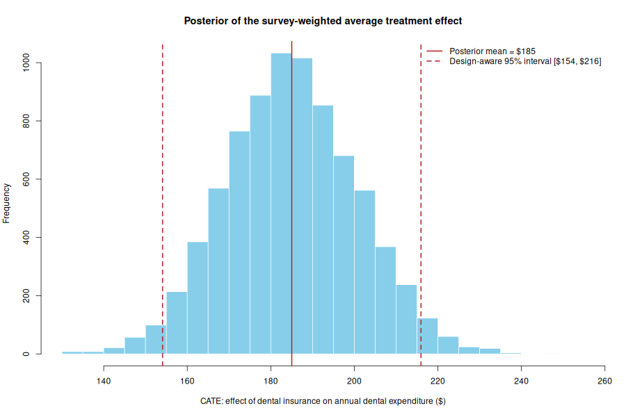
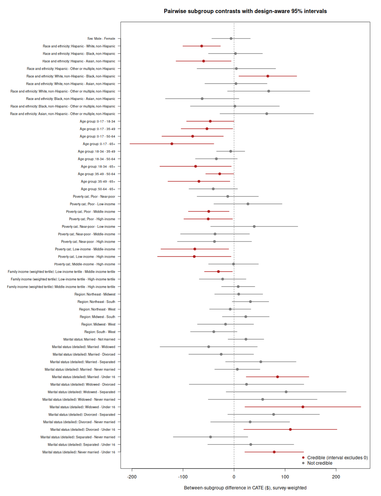
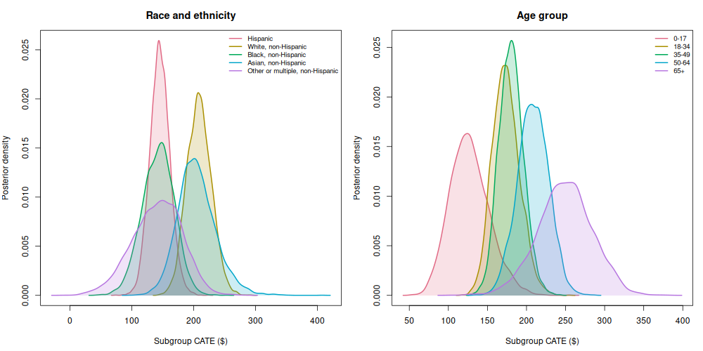
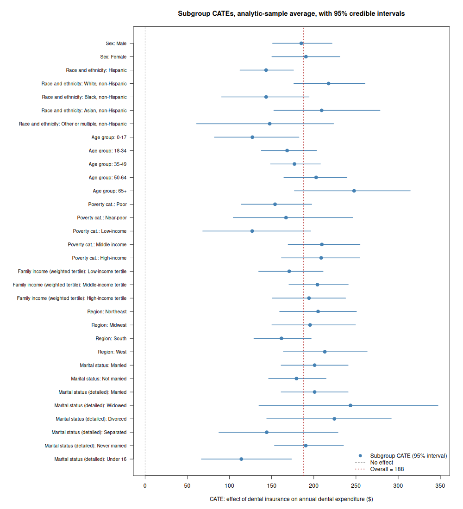
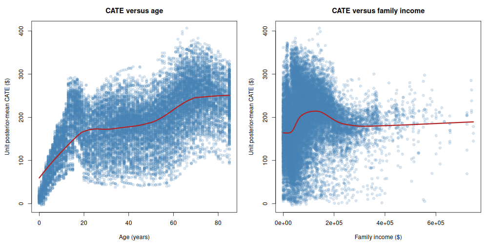
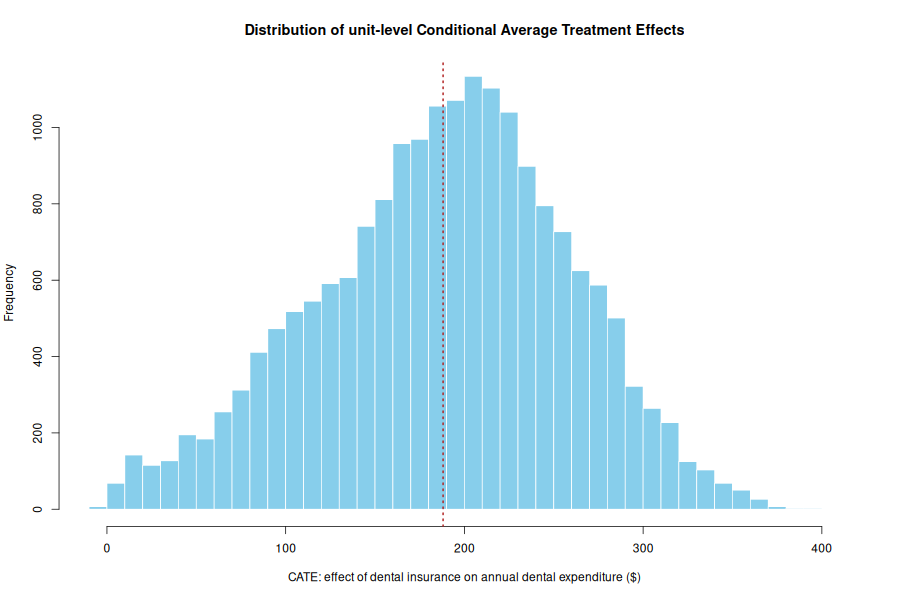

# Applied Study: Evaluating the Effect of Dental Insurance on Dental Expenditures using ZIC-BCF

This report summarizes the application of the **Zero-Inflated Continuous Bayesian Causal Forests (ZIC-BCF)** model on the 2023 Medical Expenditure Panel Survey (MEPS) dataset. 

## 1. Study Setup
- **Outcome ($Y$):** Dental Expenditures (`DVTEXP23`). This is a heavily right-skewed, semicontinuous variable with roughly 53% zeros.
- **Treatment ($Z$):** Dental Insurance (`DNTINS23_M23`). 
- **Covariates ($X$):** Age, Sex, Race, Family Income, Poverty Category, Region, and Marital Status.
- **Sample Size:** 18,763 valid participant records (after excluding invalid/inapplicable survey responses).

## 2. Estimation Procedure
1. **Propensity Score ($\hat{\pi}$):** A logistic regression model was fit to estimate the probability of having dental insurance given the covariates.
2. **Causal Forest (ZIC-BCF-Smear):** The `zicbcf_smear` function was employed to correctly model the dual-nature of the data (the hurdle to have *any* expenditure, and the continuous scale of expenditure). The model ran for 1,000 simulations (with 500 burn-in iterations) using the Subpopulation Propensity Adjustment (SPA).

## 3. Results and Treatment Effects

### Average Treatment Effect (ATE)
The estimated **Average Treatment Effect (ATE)** is **$201.61**.
- **95% Credible Interval:** [$168.65 - $235.95]

This indicates that, on average, possessing dental insurance casually increases annual dental expenditure by approximately $202. The entire 95% credible interval sits comfortably above zero, providing strong evidence of a statistically significant positive effect. The full posterior of the ATE is shown below.

### Conditional Average Treatment Effect (CATE) Analysis by Covariate Subgroups

One of the primary strengths of ZIC-BCF is uncovering treatment-effect heterogeneity. Rather than merely inspecting the marginal distribution of the unit-level effects, we conduct a *proper subgroup CATE analysis*. The fit returns a full posterior of unit-level effects (a 1,000-draw-by-18,763-unit matrix). For any subgroup we average the unit-level effects over the units in that subgroup *within each posterior draw*, which yields a posterior distribution for the subgroup CATE and therefore both a point estimate and a 95% credible interval. This is the same logic used to obtain the overall ATE, restricted to the units defining each subgroup.

The subgroup CATE estimates (with 95% credible intervals) are reported below. Every subgroup has a posterior probability of a positive effect equal to 1.00, so insurance raises expected dental spending in all subpopulations; the interesting question is *by how much*.

| Covariate | Subgroup | N | CATE ($) | 95% Credible Interval |
| :--- | :--- | ---: | ---: | :--- |
| **Overall** | All | 18,763 | 201.61 | [168.65, 235.95] |
| **Sex** | Male | 8,928 | 203.08 | [166.34, 242.96] |
| | Female | 9,835 | 200.27 | [159.87, 241.69] |
| **Race** | White | 14,004 | 219.60 | [183.61, 254.94] |
| | Black | 2,639 | 142.37 | [99.04, 193.61] |
| | Asian | 380 | 154.16 | [104.41, 212.53] |
| | Other / Multiple | 1,740 | 157.01 | [99.45, 215.00] |
| **Age group** | 0–17 | 3,647 | 153.47 | [105.10, 205.34] |
| | 18–34 | 3,352 | 192.05 | [160.86, 226.58] |
| | 35–49 | 3,468 | 193.68 | [162.70, 228.46] |
| | 50–64 | 3,760 | 223.01 | [181.80, 262.18] |
| | 65+ | 4,536 | 235.69 | [154.06, 314.16] |
| **Poverty category** | Poor | 2,834 | 164.05 | [104.10, 235.58] |
| | Near-poor | 877 | 167.57 | [99.18, 246.63] |
| | Low-income | 2,458 | 142.63 | [78.13, 212.01] |
| | Middle-income | 5,243 | 227.53 | [187.67, 271.30] |
| | High-income | 7,351 | 221.38 | [175.75, 264.99] |
| **Family income (tertile)** | Low tertile | 6,255 | 175.12 | [129.45, 230.29] |
| | Middle tertile | 6,255 | 217.64 | [182.83, 253.85] |
| | High tertile | 6,253 | 212.06 | [170.36, 253.37] |
| **Region** | Northeast | 2,892 | 204.97 | [133.15, 265.34] |
| | Midwest | 3,837 | 205.26 | [163.37, 249.01] |
| | South | 7,375 | 176.61 | [147.45, 209.46] |
| | West | 4,659 | 236.08 | [186.42, 292.97] |
| **Marital status** | Married | 7,497 | 203.46 | [158.98, 246.83] |
| | Not married | 11,266 | 200.37 | [164.31, 239.78] |

### Testing Heterogeneity: Between-Subgroup Contrasts

A difference in point estimates is only meaningful if it survives posterior uncertainty. Because the subgroup effects are computed draw-by-draw, we can form the posterior of the *difference* between any two subgroups directly and read off a 95% credible interval and the posterior probability that the difference is positive. The contrasts whose credible interval excludes zero (i.e. credible heterogeneity) are:

1. **Race (White vs. Black):** +$77.23 [$23.56, $121.91]. White beneficiaries gain markedly more than Black beneficiaries. White also credibly exceeds Asian (+$65.44 [$3.42, $117.23]) and Other/Multiple (+$62.59 [$1.21, $121.53]).
2. **Age (children vs. older adults):** the effect rises monotonically with age. The 0–17 group gains credibly less than the 50–64 group (−$69.54 [−$134.61, −$4.27]).
3. **Income / poverty:** the Low-income poverty group gains credibly less than the Middle-income group (−$84.90 [−$155.61, −$10.65]).
4. **Region (South vs. West):** the South gains credibly less than the West (−$59.47 [−$108.40, −$14.65]).

By contrast, **sex** (Male − Female = +$2.81 [−$45.11, $50.84]) and **marital status** (Married − Not married = +$3.09 [−$45.57, $45.63]) show no credible heterogeneity: the treatment effect is essentially identical across those groups. Full pairwise contrasts are saved in `cate_contrasts.csv`. The figure below shows every pairwise contrast with its 95% credible interval, with the credible differences (interval excluding zero) highlighted in red.

The posterior densities of the subgroup CATEs for Race and Age (below) make the same heterogeneity visible as a separation of whole distributions, not just point estimates.

> [!TIP]
> **Why this matters for ZIC-BCF:** The heterogeneity above (larger insurance effects for White, older, higher-income, and Western enrollees) is economically intelligible and would be easy to distort with a mis-specified single-part model given the 53% zero-inflation and massive skewness. ZIC-BCF, equipped with Duan's Smearing Re-transformation, recovers these subgroup effects on the raw dollar scale without parametric misspecification, and the draw-by-draw construction propagates full posterior uncertainty into every subgroup estimate and contrast.

## 4. Visualizing Heterogeneity

The figure below plots each subgroup CATE with its 95% credible interval. The dashed grey line marks no effect (all subgroups sit well above it) and the dotted red line marks the overall ATE, making departures from the average directly visible.

Because age and family income are continuous, we also plot each individual's posterior-mean CATE against those covariates with a LOWESS trend. The insurance effect rises steadily with age and increases with income before flattening at the top of the distribution, consistent with the subgroup tables.

For reference, the marginal distribution of the unit-level posterior-mean CATEs across all 18,763 individuals is shown below.

