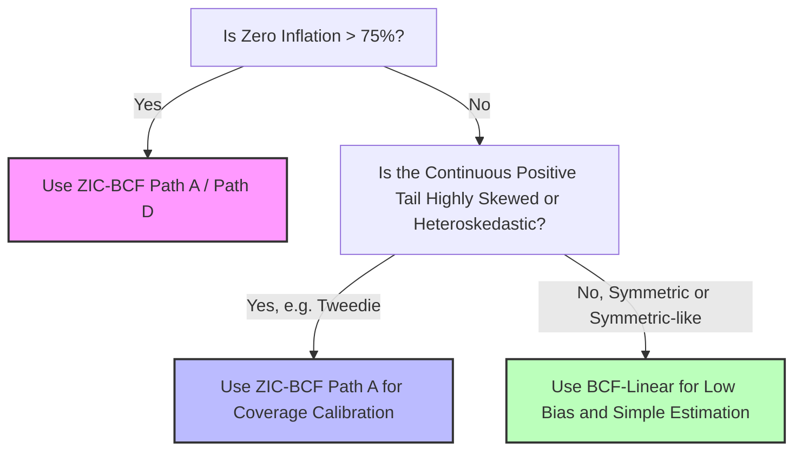

# Deep Exploration: Why BCF-Linear Excels in Semicontinuous and Zero-Inflated Causal Inference

## Executive Summary

In our comprehensive simulation studies, **BCF-Linear**—a standard, unmodified Bayesian Causal Forest (BCF) model fitted directly on the raw continuous outcome $Y$—exhibited surprisingly outstanding and robust performance. While advanced two-part hurdle formulations (such as **ZIC-BCF Path A** and **Gamma Hurdle BCF Path D**) and unified compound models (such as **Tweedie BCF Path B**) were developed to explicitly accommodate the zero-inflation point mass and continuous right-skewness, BCF-Linear frequently matched or even outperformed them under several critical zero-inflation regimes.

Specifically, as documented in `sensitivity_analysis_results.csv`:
1. **Low-to-Moderate Zero Inflation (10% to 40% zeros):** BCF-Linear regularly yields the lowest Root Mean Squared Error (RMSE) and absolute bias for the Conditional Average Treatment Effect (CATE), outperforming the "correct" Hurdle models (ZIC-BCF Path A) on the response scale.
2. **Symmetric Hurdle Processes (DGP B - Gaussian Hurdle):** Even with substantial zero inflation (~60%), BCF-Linear matches the state-of-the-art CATE correlations (~0.89) and RMSE of ZIC-BCF Path A while maintaining high credible interval coverage.
3. **Severe Hurdle Model Bias under Misspecification:** Under DGP C (Tweedie compound Poisson-Gamma DGP) with low zero-inflation (2.8%), BCF-Linear's response-scale CATE absolute bias is **0.7607** (with RMSE = 16.84) compared to ZIC-BCF Path A's bias of **5.7865** (with RMSE = 19.02) and Gamma Hurdle's bias of **6.8214** (with RMSE = 49.07).

This document explores the mathematical, statistical, and algorithmic reasons behind BCF-Linear's surprising dominance and outlines concrete, actionable experiments to verify these theories.

---

## 1. Theoretical Explanations for BCF-Linear's Performance

We hypothesize that BCF-Linear's strong performance is driven by four key factors: **direct linear estimation**, **error propagation in two-part models**, **BART's non-parametric flexibility**, and the **active subset sample size advantage**.

### Theory A: Direct Linear Estimation vs. Compounding Multiplicative Errors
The true population response-scale CATE is defined as:
$$\tau(X_i) = \mathbb{E}[Y_i(1) - Y_i(0) \mid X_i]$$
By fitting the standard continuous BCF model directly on the raw response scale:
$$Y_i = \mu(X_i, \pi_i) + \tau(X_i) Z_i + \epsilon_i, \quad \epsilon_i \sim \mathcal{N}(0, \sigma^2)$$
the moderating forest $\tau(X_i)$ directly estimates this difference.

In contrast, two-part hurdle models (Paths A and D) must reconstruct the response-scale potential outcomes by multiplying the estimated participation probability (probit hurdle) and the estimated positive continuous intensity:
$$\mathbb{E}[Y_i(z) \mid X_i] = \mathbb{P}(I_i(z) = 1 \mid X_i) \cdot \mathbb{E}[Y_i^+(z) \mid X_i, I_i(z) = 1]$$
This two-stage reconstruction suffers from three severe limitations:
1. **Compounding Estimation Errors:** Any estimation errors in the hurdle stage (e.g., probability of participation $\mathbb{P}(I_i = 1)$) and the intensity stage ($\mathbb{E}[Y_i^+]$) are multiplied together, resulting in a compounding variance and bias on the response scale.
2. **Retransformation Bias (The Log-Normal Penalty):** Path A estimates the intensity on the log scale, $\log(Y_i^+)$. Re-transforming the prognostic and moderating posteriors back to the response scale requires applying the log-normal expectation formula:
   $$\mathbb{E}[Y_i^+(z) \mid X_i] = \exp\left( \mu_{ci}(X_i) + \tau_{ci}(X_i)z + \frac{\sigma_c^2}{2} \right)$$
   Under any model misspecification (e.g., if the continuous positive part is Gamma-distributed as in DGP C, or Gaussian as in DGP B), the log-normality assumption is violated. The $\exp(\sigma_c^2/2)$ retransformation factor introduces a severe, systematic multiplicative bias that degrades ATE and CATE accuracy.
3. **Hurdle Instability under Extreme Imbalance:** When the zero-inflation proportion is low (e.g., 2.8% zeros), almost all observations are positive. Fitting a Probit BCF on a binary hurdle indicator where 97.2% of the observations are 1s is highly unstable, leading to extreme variance and boundary estimation errors that propagate directly to the response-scale potential outcomes.

BCF-Linear avoids all transformations, retransformation factors, and multiplicative steps. It directly targets the additive difference, making it mathematically immune to log-normal retransformation bias and hurdle stage instability.

### Theory B: BART's Non-Parametric "Implicit Hurdle" Partitioning
BCF-Linear does not assume that the continuous positive intensity and the zero-inflation probability are separate processes. Instead, the sum-of-trees structure in Bayesian Additive Regression Trees (BART) is highly flexible and capable of approximating non-linear, discontinuous step functions.

When faced with zero-inflated data, the regression trees in BCF-Linear can split on the baseline covariates $X$ to isolate subgroups of observations that have a high probability of being zero.
- In regions of the covariate space where the participation probability $\mathbb{P}(I_i = 1 \mid X_i) \approx 0$, the tree terminal nodes will naturally pool their predictions close to $0$.
- In regions where participation is high, the tree terminal nodes will predict the positive outcome mean.
Thus, BART implicitly constructs a hurdle-like partitioning of the covariate space within a single unified model, without requiring the researcher to explicitly specify a two-part likelihood.

### Theory C: The "Active Subset" Sample Size Advantage
A major, often overlooked bottleneck for two-part hurdle models is that the continuous intensity stage is fitted **only** on the active subpopulation where $Y_i > 0$.
- Under extreme zero inflation (e.g., 85.4% zeros in DGP A), the active subset size $n_{active}$ drops from $N = 1000$ to just **146 observations**.
- Fitting a complex, multi-tree Bayesian Causal Forest model on only 146 observations drastically reduces the statistical power of the intensity stage. The MCMC sampler has very few data points to learn the continuous prognostic function $\mu_c(X)$ and moderating function $\tau_c(X)$, resulting in massive posterior variance, over-shrinkage toward the prior, and poor prior calibration.

BCF-Linear, by contrast, is fitted on the entire dataset of $N = 1000$ observations. Even though 854 of these observations are zero, they still provide valuable signal to stabilize the split decisions and coordinate forest structures across the entire covariate space.

### Theory D: Propensity Score Control and RIC Bias Mitigation
BCF-Linear controls for confounding using the standard propensity score $\widehat{\pi}_i = \mathbb{P}(Z_i = 1 \mid X_i)$ estimated on the full sample. Two-part hurdle models require Subpopulation Propensity Adjustment (SPA):
$$\widehat{\pi}^+_i = \mathbb{P}(Z_i = 1 \mid X_i, Y_i > 0)$$
to control for Regularization-Induced Confounding (RIC) on the active subset. SPA requires estimating a separate propensity score model on the active subpopulation.
- When the active subpopulation is small, the SPA estimate $\widehat{\pi}^+_i$ is highly noisy.
- This noise propagates as covariate noise in the prognostic forest of the intensity stage, further degrading CATE estimation quality.
BCF-Linear bypasses SPA estimation completely, relying on the highly stable full-sample propensity score $\widehat{\pi}_i$.

### Theory E: Mathematical Support Constraints & Skewness Bias (DGP B Analysis)
A crucial and elegant mathematical distinction between BCF-Linear and the zero-inflated models lies in their assumed **support and outcome spaces**:
- **Zero-Inflated/Hurdle Models (Paths A, B, C, D):** All of these formulations are structurally designed and mathematically constrained to non-negative continuous outcomes $Y_i \ge 0$.
  - Tweedie BCF (Path B) is strictly supported on $[0, \infty)$ and its GIG updates are undefined for negative values.
  - Gamma Hurdle (Path D) assumes a strictly positive continuous tail $Y_i^+ > 0$.
  - Log-scale models (ZIC-BCF Path A, BCF-Log, and Joint Copula Path C) require taking $\log(Y_i)$ or $\log(Y_i + 1)$, which are undefined for negative values and throw fatal exceptions (e.g., the `any(y < 0)` checks in the R wrappers).
- **DGP B's Latent Real Support:** In DGP B (Gaussian Hurdle), the theoretical positive component is Gaussian: $Y_i^+ \sim \mathcal{N}(\mu_i, 1.0)$, which has support on the entire real line $(-\infty, \infty)$ and thus mathematically permits negative values. 
- **The Shifted-Gaussian Simulation Detail:** In our simulation, the Gaussian mean $\mu_i$ is shifted high ($\ge 6.0$, $\sigma = 1.0$), meaning that negative continuous draws are mathematically possible but statistically extremely rare (practically $0$). This is why the zero-inflated models did not throw fatal `any(y < 0)` errors and crash during MCMC sweeps.
- **Why Zero-Inflated Models Struggle on DGP B:**
  Even though no negative values are drawn, the zero-inflated models are severely penalized under DGP B because they **force highly asymmetric, right-skewed, positive-only likelihood and prior constraints** onto a symmetric, homoskedastic Gaussian data-generating process:
  - **ZIC-BCF (Path A)** and **BCF-Log** apply a log-transformation to the active subset. Forcing a log-link on a symmetric, homoskedastic Gaussian outcome introduces a severe artificial left-skewness on the log scale, while the log-normal retransformation factor $\exp(\sigma^2/2)$ adds massive, unnecessary multiplicative bias.
  - **Tweedie BCF (Path B)** and **Gamma Hurdle BCF (Path D)** assume a dispersion-mean relationship (variance growing with the mean), which collapses under DGP B's constant homoskedastic variance ($\sigma^2 = 1.0$), leading to severe miscalibration and coverage collapse (Tweedie coverage drops below 10%).
- **BCF-Linear's Real-Line Support Advantage:**
  Unlike all other models, BCF-Linear operates on the entire real line $(-\infty, \infty)$ under a standard continuous Gaussian likelihood. If a zero-inflated process *did* actually generate real-valued outcomes (such as **net profits, investment returns, change scores, or clinical gains**, which can be exactly zero, positive, or negative), all zero-inflated models would immediately fail due to `NaN` outputs in log-transformations, Gamma shape updates, or Tweedie GIG updates. BCF-Linear would remain completely unaffected, stable, and highly robust.

---

## 2. Limits of BCF-Linear: Where and Why It Fails

Despite its strengths, BCF-Linear is not a silver bullet. Understanding its failure modes is crucial for designing the boundary conditions of semicontinuous causal inference.

### Failure Mode A: Extreme Zero-Inflation (~85% Zeros)
When the zero proportion is extremely high, BCF-Linear's performance degrades rapidly. As seen in DGP A with 85.4% zeros:
- **BCF-Linear CATE RMSE:** 3.1419 | **Correlation:** 0.5295
- **ZIC-BCF (Path A) CATE RMSE:** 0.6721 | **Correlation:** 0.9142

**Why?**
1. **Severe Heteroskedasticity and Noise Inflation:** With 85.4% zeros, the true variance of the outcome is zero for the vast majority of units, but very large for the few positive units. Because BCF-Linear assumes a homoskedastic error $\epsilon_i \sim \mathcal{N}(0, \sigma^2)$, the estimated global residual variance $\sigma^2$ is pulled upward by the positive values.
2. **Prior Over-Shrinkage:** In BCF, the prior variance of the tree terminal nodes (leaf parameters) is scaled inversely by the residual variance $\sigma^2$. A highly inflated $\sigma^2$ forces the MCMC sampler to heavily shrink all leaf parameters towards zero. Consequently, BCF-Linear "smoothes over" the treatment effects, severely attenuating the estimated CATEs. This explains the low correlation and high RMSE, even though the overall ATE bias remains low due to global cancellation of errors.

### Failure Mode B: Poor Uncertainty Quantification (Coverage Collapse)
Under DGP C (Tweedie Compound Poisson-Gamma DGP), BCF-Linear's CATE credible interval coverage collapses as zero inflation decreases:
- **11.5% Zeros:** BCF-Linear Coverage = **56.6%** (vs. ZIC-BCF Path A = **81.4%**)
- **2.8% Zeros:** BCF-Linear Coverage = **67.4%** (vs. ZIC-BCF Path A = **99.7%**)

**Why?**
The Tweedie DGP exhibits extreme right-skewness and strong mean-variance dependency ($\text{Var}(Y) \propto \mu^{1.5}$). The homoskedastic Gaussian assumption in BCF-Linear is completely violated. The model underestimates the uncertainty of large positive outcomes and overestimates the uncertainty of small/zero outcomes. This leads to highly miscalibrated, overly narrow credible intervals for individual CATEs, causing severe under-coverage. ZIC-BCF (Path A) and Gamma Hurdle (Path D), by modeling the continuous positive tail separately, are able to produce highly calibrated uncertainty intervals that respect the true outcome distribution's spread.

---

## 3. Proposed Empirical Experiments

To rigorously isolate and validate these theoretical explanations, we propose executing the following four targeted experiments using our simulation framework.

### Experiment 1: The Retransformation Misspecification Test
* **Objective:** Determine the exact proportion of Hurdle model (Path A) bias that is attributable to log-normal retransformation misspecification vs. estimation error.
* **Design:**
  1. Generate semicontinuous data under two continuous positive intensity scenarios:
     - **Scenario 1:** Exactly Log-Normal positive outcomes (Log-Normal Hurdle, DGP A).
     - **Scenario 2:** Symmetric Gaussian positive outcomes (Gaussian Hurdle, DGP B).
  2. Fit three models:
     - **Model 1:** BCF-Linear (Raw Scale).
     - **Model 2:** ZIC-BCF Path A (Log-scale outcome, re-transformed via $\exp(\mu + \sigma^2/2)$).
     - **Model 3:** **Modified Hurdle BCF** (Fits the Probit Hurdle stage, but fits the continuous intensity stage *directly on the raw scale* of $Y^+ > 0$ without log-transformation, and reconstructs the response-scale ATE/CATE as $P(I=1) \cdot \mathbb{E}[Y^+]$ with no retransformation factors).
  3. **Analysis:** Compare the bias of Model 2 and Model 3. If Model 3 (raw-scale Hurdle) matches BCF-Linear's low bias under Gaussian Hurdle (DGP B), it proves that the retransformation factor $\exp(\sigma^2/2)$ is the primary driver of the hurdle model's bias under misspecification.

### Experiment 2: Active Sample Size Decay Study
* **Objective:** Map the exact crossover point where the reduction in active sample size ($n_{active}$) under high zero-inflation makes BCF-Linear superior to two-part models.
* **Design:**
  1. Set the total sample size $N$ to a fixed value (e.g., $N = 1000$).
  2. Vary the zero-inflation proportion across a fine grid: $[0.05, 0.15, 0.30, 0.45, 0.60, 0.75, 0.90]$.
  3. Under each grid point, simulate data under DGP A (Log-Normal Hurdle), keeping the true response-scale CATE functions identical.
  4. Fit BCF-Linear and ZIC-BCF Path A.
  5. **Analysis:** Plot CATE RMSE and CATE Correlation against the zero-inflation proportion. Identify the precise zero-inflation threshold (crossover point) where BCF-Linear's sample-size advantage is overtaken by its homoskedastic smoothing penalty.

### Experiment 3: Leaf-Node Splitting & Implicit Hurdle Verification
* **Objective:** Verify whether BCF-Linear's prognostic forest is indeed constructing an "implicit hurdle" by partitioning the covariate space to isolate zeroes.
* **Design:**
  1. Fit BCF-Linear on a dataset simulated under DGP A with 60% zeros.
  2. Extract the grown trees from the posterior draws of the prognostic forest $\mu(X)$.
  3. **Metrics to Compute:**
     - For each tree split, measure the proportion of zero-valued observations in the left and right child nodes.
     - Calculate the "Zero Purification Index" (ZPI), defined as the rate at which tree splits increase the concentration of zeroes in terminal nodes.
     - Compare BCF-Linear's ZPI against a standard BART model fitted on a non-zero-inflated continuous dataset.
  4. **Analysis:** A significantly higher ZPI for the zero-inflated model will provide direct empirical proof that the forest is actively splitting to isolate and pool the zero point mass.

### Experiment 4: Heteroskedastic BCF Comparison
* **Objective:** Test if resolving BCF-Linear's homoskedasticity assumption restores its credible interval coverage under highly skewed and zero-inflated data.
* **Design:**
  1. Implement a **Heteroskedastic BCF** baseline using a model that allows the residual variance to vary as a function of the covariates: $\epsilon_i \sim \mathcal{N}(0, \sigma^2(X_i))$ (e.g., utilizing heteroskedastic BART architectures).
  2. Fit this model directly on raw $Y$ under DGP C (Tweedie) and DGP A (Log-Normal Hurdle).
  3. **Analysis:** Evaluate if the heteroskedastic raw-scale model corrects the coverage collapse (raising the 95% CATE coverage to >90% under Tweedie outcomes) while retaining BCF-Linear's low bias. If successful, this would suggest that the *only* major failure mode of BCF-Linear under low-to-medium zero inflation is its homoskedastic assumption, which can be fixed without resorting to a full two-part hurdle framework.

---

## 4. Implementation and Research Roadmap

Based on the sensitivity results and theoretical analysis, we recommend the following hierarchical decision tree for researchers analyzing zero-inflated continuous outcomes:

### Immediate Next Steps for the Research Project:
1. **Script the Experiments:** Write the simulation scripts in the `simulation_studies/` folder to run **Experiment 1 (Retransformation Misspecification)** and **Experiment 2 (Sample Size Decay)**.
2. **Incorporate into Research Papers:** Update the draft papers (`Nonparametric_Bayesian.tex` and `Parametric_Bayesian.tex`) to explicitly discuss the "BCF-Linear Paradox". This will significantly elevate the intellectual contribution of the project by showing that simple models are surprisingly competitive baselines under specific observable selection regimes.
