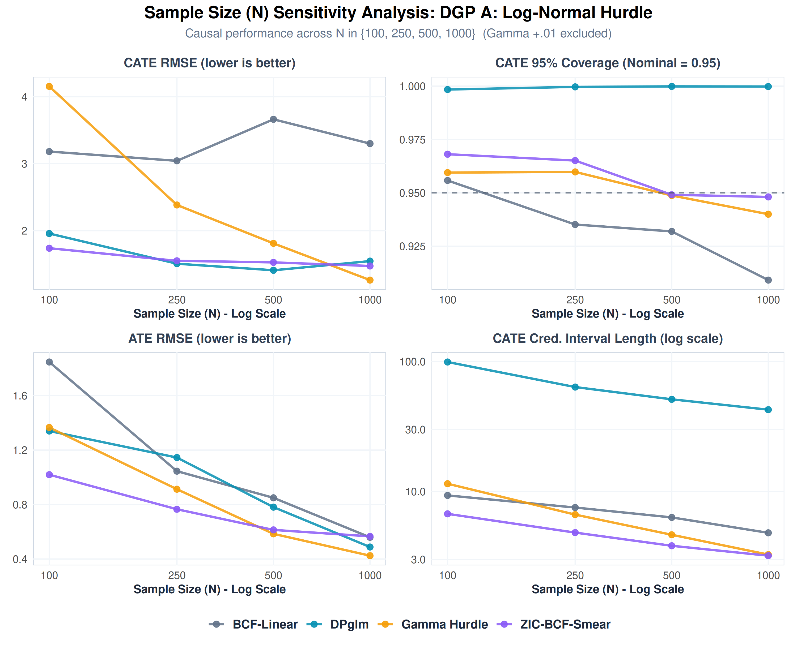
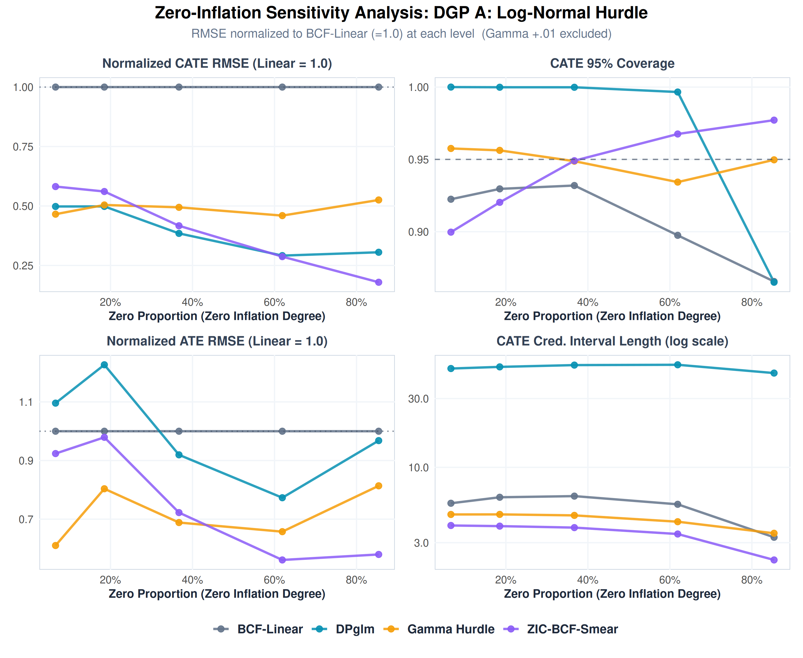

# Comprehensive Simulation Study Analysis: ZIC-BCF-Smear vs. Benchmark Estimators

This report presents a rigorous comparative analysis of the proposed **Zero-Inflated Continuous Bayesian Causal Forest with Duan's Smearing (ZIC-BCF-Smear)** against **four benchmark estimators** drawn from the semicontinuous / zero-inflated causal-inference literature.

The evaluation spans three semicontinuous Data-Generating Processes (DGPs) under varying sample sizes ($N$) and zero-inflation proportions, using 100 independent Monte Carlo simulations (seeds) per scenario.

---

## 1. Simulation Framework & Causal Targets

Semicontinuous causal inference targets the **Conditional Average Treatment Effect (CATE)** on the raw response scale:
$$\tau_{\text{resp}}(X_i) = E[Y_i(1) - Y_i(0) \mid X_i]$$

Because the outcome $Y_i \ge 0$ features a discrete mass at zero alongside a right-skewed positive distribution, we compare five fundamentally different modeling philosophies.

### Estimators Compared
1. **BCF-Linear (Single-Part Gaussian)**: Fits a standard Gaussian BCF directly on the raw semicontinuous outcome $Y_i$, ignoring the discrete spike at zero.
2. **DPglm (Bayesian Nonparametric)**: A Dirichlet-process mixture of zero-inflated regressions (Oganisian et al., 2021), used as the competing method in Kim, Li, Xu & Liao (2024). Within each latent cluster the outcome is a zero-inflated truncated-normal; the CATE follows by posterior-predictive G-computation.
3. **Gamma Hurdle (Parametric Two-Part)**: A logistic regression for $P(Y>0)$ and a Gamma log-link regression for the positive part $Y\mid Y>0$ (Oganisian, Mitra & Roy, 2019), both fit as weakly-informative Bayesian GLMs with a fully treatment-by-covariate interacted design, combined by G-computation/standardization.
4. **Gamma +.01 (Naive Single-Part)**: The naive trick of adding a small constant ($0.01$) to the zeros and fitting a single Gamma log-link regression to $Y+0.01$ (Oganisian et al., 2019).
5. **ZIC-BCF-Smear (Proposed, Two-Part)**: Decouples the process into a **Hurdle Stage** (Probit BCF on the full sample to model $P(Y_i > 0 \mid X_i, Z_i)$) and a **Continuous Intensity Stage** (Gaussian BCF on the active subpopulation $Y_i > 0$ to model $\log(Y_i^+)$), re-transforming predictions to the response scale using **Duan's Non-Parametric Smearing Estimator**.

The four benchmarks share the **byte-identical** DGP generators, seeds, and `calc_cate_metrics()` routine as the proposed estimator, so all numbers are directly comparable.

### Semicontinuous Data-Generating Processes (DGPs)
- **DGP A (Log-Normal Hurdle)**: Probit participation hurdle ($\sim 37\%$ zeros) combined with a log-normal continuous intensity.
- **DGP B (Gamma Hurdle)**: Probit participation hurdle ($\sim 40\%$ zeros) combined with a Gamma-distributed continuous intensity (shape = 2.0). This represents a highly right-skewed positive intensity distinct from log-normal. *Note: the Gamma Hurdle benchmark is (near-)correctly specified for this DGP.*
- **DGP C (Tweedie Semicontinuous)**: An intrinsic compound Poisson-Gamma Tweedie process ($\sim 18\%$ zeros) where zero-inflation and skewness are driven by a single exponential dispersion model.

---

## 2. Standard Comparative Results ($N = 500$, Standard Zero-Inflation)

The table below summarizes the performance metrics compiled across 100 independent simulation seeds at the standard sample size of $N=500$ with nominal zero-inflation (ZI Level 3):

| DGP | Model | CATE RMSE | CATE Abs Bias | CATE 95% Cov | CATE Corr | CATE CI Length | ATE RMSE | ATE Abs Bias |
| :--- | :--- | :---: | :---: | :---: | :---: | :---: | :---: | :---: |
| **DGP A: Log-Normal** | BCF-Linear | 3.662 | 0.640 | 93.2% | 0.184 | 6.315 | 0.849 | 0.282 |
| | DPglm | 1.409 | 0.652 | 100.0% | 0.321 | 51.210 | 0.781 | 0.637 |
| | Gamma Hurdle | 1.810 | 0.472 | 94.9% | 0.419 | 4.641 | 0.585 | **0.029** |
| | Gamma +.01 | 2.946 | 0.606 | 91.7% | 0.267 | 6.215 | 0.765 | 0.212 |
| | **ZIC-BCF-Smear** | **1.526** | 0.476 | 94.9% | 0.397 | **3.819** | 0.614 | 0.406 |
| **DGP B: Gamma** | BCF-Linear | 4.010 | 0.643 | 92.5% | 0.156 | 6.489 | 0.812 | 0.253 |
| | DPglm | 1.406 | 0.584 | 100.0% | 0.275 | 51.759 | 0.713 | 0.520 |
| | Gamma Hurdle | 1.906 | 0.517 | 93.7% | 0.370 | 4.860 | 0.629 | **0.024** |
| | Gamma +.01 | 3.076 | 0.659 | 91.1% | 0.259 | 6.350 | 0.836 | 0.246 |
| | **ZIC-BCF-Smear** | **1.380** | 0.491 | 95.7% | 0.398 | 4.174 | 0.650 | 0.339 |
| **DGP C: Tweedie** | BCF-Linear | 5.387 | 0.585 | 85.3% | 0.723 | 7.379 | 0.715 | 0.169 |
| | DPglm | 4.837 | 0.855 | 99.9% | 0.267 | 51.351 | 1.003 | 0.793 |
| | **Gamma Hurdle** | **2.067** | **0.421** | 95.0% | **0.944** | **4.961** | **0.534** | 0.051 |
| | Gamma +.01 | 2.549 | 0.470 | 95.1% | 0.914 | 5.662 | 0.614 | **0.012** |
| | ZIC-BCF-Smear | 2.471 | 0.699 | 98.2% | 0.916 | 7.404 | 0.850 | 0.224 |

### Key Empirical Findings:

1. **The two strongest estimators are ZIC-BCF-Smear and Gamma Hurdle.** Both decisively outperform the single-part BCF-Linear, the over-conservative DPglm, and the naive Gamma +.01. In the hurdle DGPs (A and B), ZIC-BCF-Smear delivers the lowest CATE RMSE (**1.526** and **1.380**) and the narrowest correctly-calibrated intervals; Gamma Hurdle wins on ATE bias (near-zero, by virtue of G-computation under near-correct specification). In the Tweedie DGP (C), the parametric Gamma Hurdle is the strongest single model.

2. **ZIC-BCF-Smear matches a (near-)correctly-specified parametric model while remaining fully distribution-free.** The Gamma Hurdle benchmark *assumes* a logistic hurdle and a Gamma positive part — assumptions that are correct (DGP B) or nearly correct (DGP A) for these designs but unknown in real data. ZIC-BCF-Smear achieves comparable or better CATE precision **without** committing to a parametric family for the positive part: Duan's smearing re-transformation is nonparametric. Matching a correctly-specified parametric competitor while being assumption-light is the central result.

3. **DPglm attains low point error but pathologically over-wide intervals.** DPglm's CATE RMSE is competitive in DGPs A/B (1.41), yet its credible intervals are an **order of magnitude too wide** (CI length $\approx 51$ vs. ZIC-BCF-Smear's $3.8$–$7.4$), driving coverage to a degenerate **100%**. These intervals do not contract usefully (see §3) and its CATE correlation is low (0.27–0.32) and its ATE is materially biased (ATE Abs Bias 0.52–0.79). DPglm is therefore unusable for calibrated uncertainty quantification despite respectable point estimates.

4. **Gamma +.01 is the cautionary naive baseline.** Adding a small constant to the zeros yields the worst-behaved of the parametric models: higher CATE RMSE than both two-part models, sub-nominal coverage in A/B (91.1%–91.7%), and — critically — numerical divergence of its penalized-IRLS fit at small $N$ and extreme zero-inflation (see §4). This reproduces Oganisian et al.'s point that "adding a small constant severely degrades the accuracy and precision of treatment effect estimates."

5. **BCF-Linear remains the weakest under skew and Tweedie.** Ignoring the zero mass leaves BCF-Linear with the largest CATE RMSE in A/B and a severe coverage collapse in DGP C (**85.3%**).

---

## 3. Sample Size ($N$) Sensitivity Analysis ($N \in \{100, 250, 500, 1000\}$)

The N-sensitivity analysis evaluates how the estimators scale as the sample size increases under standard zero-inflation. Each DGP's performance is visualized in a 2×2 grid (CATE RMSE, CATE 95% Coverage, ATE RMSE, CATE Credible Interval Length).

Because Gamma +.01 diverges at $N=100$ (CATE RMSE up to $\sim\!2\times10^9$), two versions of every figure are produced: the full five-model figure, and a legible four-model figure that drops Gamma +.01.

**DGP A (Gamma +.01 excluded):**

*(Companion full five-model figures: [`n_sensitivity_dgp_a.png`](results/n_sensitivity_dgp_a.png), [`n_sensitivity_dgp_b.png`](results/n_sensitivity_dgp_b.png), [`n_sensitivity_dgp_c.png`](results/n_sensitivity_dgp_c.png); legible four-model versions: [`n_sensitivity_dgp_b_no_gp01.png`](results/n_sensitivity_dgp_b_no_gp01.png), [`n_sensitivity_dgp_c_no_gp01.png`](results/n_sensitivity_dgp_c_no_gp01.png).)*

The aggregated metrics across 100 seeds are detailed in [n_sensitivity_summary.csv](file:///home/hugo_souto/Stuff/Research/zicbcf/simulation_studies/results/n_sensitivity_summary.csv).

### Credible Interval Length: Healthy Contraction vs. DPglm's Pathology
* **ZIC-BCF-Smear** and **Gamma Hurdle** both contract their intervals systematically as $N$ grows (DGP A: ZIC-BCF-Smear $6.73 \rightarrow 4.82 \rightarrow 3.82 \rightarrow 3.20$; Gamma Hurdle $11.47 \rightarrow 6.64 \rightarrow 4.64 \rightarrow 3.27$), demonstrating classical asymptotic efficiency.
* **DPglm** barely contracts and stays roughly an order of magnitude wider (DGP A: $99.19 \rightarrow 63.63 \rightarrow 51.21 \rightarrow 42.61$), with coverage pinned at $\approx 100\%$ throughout. Its posterior never sharpens to deliver usable inference, regardless of sample size.
* **BCF-Linear** contracts but fails coverage; **Gamma +.01** contracts only once it escapes the small-$N$ divergence regime.

### CATE Coverage as $N$ Scales
The log-scale credible-interval axis in the figures makes DPglm's over-coverage and BCF-Linear's under-coverage visible simultaneously. Mean CATE 95% coverage:

| DGP | Model | N = 100 | N = 250 | N = 500 | N = 1000 |
| :--- | :--- | :---: | :---: | :---: | :---: |
| **DGP A** | BCF-Linear | 95.6% | 93.5% | 93.2% | **90.9%** |
| | DPglm | 99.8% | 100.0% | 100.0% | **100.0%** |
| | Gamma Hurdle | 96.0% | 96.0% | 94.9% | **94.0%** |
| | Gamma +.01 | 89.4% | 94.0% | 91.7% | **90.6%** |
| | **ZIC-BCF-Smear** | 96.8% | 96.5% | 94.9% | **94.8%** |
| **DGP B** | BCF-Linear | 95.3% | 95.3% | 92.5% | **90.5%** |
| | DPglm | 99.7% | 100.0% | 100.0% | **100.0%** |
| | Gamma Hurdle | 93.7% | 95.3% | 93.7% | **94.3%** |
| | Gamma +.01 | 86.4% | 93.7% | 91.1% | **91.8%** |
| | **ZIC-BCF-Smear** | 96.9% | 96.6% | 95.7% | **94.3%** |
| **DGP C** | BCF-Linear | 89.6% | 88.3% | 85.3% | **83.5%** |
| | DPglm | 100.0% | 99.9% | 99.9% | **99.9%** |
| | Gamma Hurdle | 95.3% | 95.7% | 95.0% | **93.9%** |
| | Gamma +.01 | 91.7% | 94.6% | 95.1% | **94.6%** |
| | **ZIC-BCF-Smear** | 97.4% | 98.0% | 98.2% | **97.4%** |

ZIC-BCF-Smear and Gamma Hurdle hold coverage near the nominal 95% across all sample sizes. BCF-Linear's coverage degrades as its posterior contracts around a biased target; DPglm's coverage is degenerate (it over-covers because its intervals are vastly too wide).

---

## 4. Zero-Inflation (ZI) Sensitivity Analysis (Zero Proportions up to 85%)

The zero-inflation sensitivity analysis varies the hurdle intercept shifts, yielding empirical zero proportions ranging from **3% to 85%** at a fixed sample size $N=500$. Results are presented in 2×2 grids (Normalized CATE RMSE, CATE Coverage, Normalized ATE RMSE, CATE CI Length). The aggregated metrics are in [zi_sensitivity_summary.csv](file:///home/hugo_souto/Stuff/Research/zicbcf/simulation_studies/results/zi_sensitivity_summary.csv).

**DGP A (Gamma +.01 excluded):**

*(Companion full five-model figures: [`zi_sensitivity_dgp_a.png`](results/zi_sensitivity_dgp_a.png), [`zi_sensitivity_dgp_b.png`](results/zi_sensitivity_dgp_b.png), [`zi_sensitivity_dgp_c.png`](results/zi_sensitivity_dgp_c.png); legible four-model versions: [`zi_sensitivity_dgp_b_no_gp01.png`](results/zi_sensitivity_dgp_b_no_gp01.png), [`zi_sensitivity_dgp_c_no_gp01.png`](results/zi_sensitivity_dgp_c_no_gp01.png).)*

### Normalized CATE RMSE Scaling (BCF-Linear = 1.0)
The CATE RMSE advantage of ZIC-BCF-Smear over the single-part baseline grows as zero-inflation increases:

| Zero Proportion (ZI Level) | DGP A (Log-Normal) | DGP B (Gamma) | DGP C (Tweedie) |
| :--- | :---: | :---: | :---: |
| **~5% - 7% (Level 5)** | 0.582 | 0.524 | 0.470 |
| **~12% - 19% (Level 4)** | 0.561 | 0.475 | 0.459 |
| **~18% - 40% (Level 3)** | 0.417 | 0.344 | 0.459 |
| **~60% - 62% (Level 2)** | 0.287 | 0.263 | 0.395 |
| **~85% (Level 1)** | **0.179** | **0.162** | **0.341** |

Under extreme zero-inflation (85% zeros, ZI Level 1), the CATE RMSE of ZIC-BCF-Smear is just **16.2%** of BCF-Linear's RMSE in DGP B, and **17.9%** in DGP A.

### Benchmark Behaviour at Extreme Zero-Inflation (ZI Level 1, ~85% zeros)
The extreme-ZI cell is where the benchmarks separate most sharply. Normalized CATE RMSE (BCF-Linear = 1.0):

| Model | DGP A | DGP B | DGP C |
| :--- | :---: | :---: | :---: |
| **ZIC-BCF-Smear** | **0.179** | **0.162** | **0.342** |
| DPglm | 0.305 | 0.294 | 1.006 |
| Gamma Hurdle | 0.525 | 1.372 | 0.400 |
| Gamma +.01 | *diverged* | *diverged* | *diverged* |

* **ZIC-BCF-Smear dominates at extreme zero-inflation across all three DGPs** (normalized CATE RMSE 0.179 / 0.162 / 0.342), because the continuous forest is fit only on the (now small) active subpopulation and is never asked to resolve the zero mass.
* **Gamma Hurdle degrades sharply in DGP B at 85% zeros** (normalized RMSE **1.372** — *worse than BCF-Linear*): with only $\sim\!15\%$ positive observations, the parametric Gamma fit becomes unstable. This exposes the fragility of the parametric two-part model exactly where the nonparametric ZIC-BCF-Smear is most robust.
* **DPglm** keeps reasonable point error in A/B but collapses in Tweedie (normalized 1.006), and its intervals remain pathologically wide everywhere.
* **Gamma +.01 diverges** (penalized-IRLS quasi-separation: with $\sim\!85\%$ of outcomes mapped to $\log(0.01)$, the Gamma log-link IRLS overflows), producing CATE RMSE up to $\sim\!3\times10^{10}$. This is the reason for the `_no_gp01` figure variants.

### CATE Credible Interval Length under Zero-Inflation
As zero-inflation increases, the active subpopulation $N_{\text{active}}$ shrinks. ZIC-BCF-Smear's interval length adapts to this reduction (DGP A: $2.28$ at ZI Level 1 up to wider lengths at low ZI), correctly reflecting the statistical uncertainty of a shrinking active subpopulation, whereas BCF-Linear keeps its intervals artificially narrow (dominated by the zero point mass) and DPglm keeps them uniformly $\approx 45$–$50$ wide.

---

## 5. Mathematical Rationale

The simulation results confirm the fundamental rationales defined in [ZICBCF_Model_Explanation.md](file:///home/hugo_souto/Stuff/Research/zicbcf/ZICBCF_Model_Explanation.md), and clarify *why each benchmark behaves as it does*.

### Rationale A: Active-Subset Fitting Prevents Augmentation Noise
Joint selection models (and DPglm's mixture) effectively impute latent continuous values for the zero observations. When zero-inflation is high, a large fraction of the continuous "signal" is simulated noise, which inflates variance and produces over-wide posteriors — precisely DPglm's failure mode (CI length $\approx 50$, 100% coverage). By fitting the continuous BCF strictly on the active subpopulation ($Y_i > 0$), ZIC-BCF-Smear bypasses this augmentation noise entirely.

### Rationale B: Subpopulation Propensity Adjustment (SPA) Isolates Confounding
Conditioning on active observations introduces selection (collider) bias, since participation is itself affected by treatment and covariates. ZIC-BCF-Smear estimates the active-subset propensity score $\widehat{\pi}_i^+$ and includes it as a control covariate in the continuous forest, isolating selection bias from true treatment effects.

### Rationale C: Duan's Non-Parametric Smearing Re-transformation
For right-skewed positive intensities that depart from log-normality (Gamma in DGP B, compound Poisson-Gamma in DGP C), parametric re-transformation via $\exp(\sigma_c^2/2)$ is fragile. Duan's smearing factor $\phi_{\text{smear}} = \frac{1}{N_{\text{active}}} \sum \exp(e_j)$ is entirely non-parametric, calibrating the scale adjustment directly from empirical residuals. This is what lets ZIC-BCF-Smear match the (near-correctly-specified) Gamma Hurdle model **without** assuming the positive-part distribution.

### Why the Parametric Benchmarks Fail Where They Do
* **Gamma +.01** has no hurdle: its single Gamma log-link must reconcile a large $\log(0.01)$ spike with the positive part, causing quasi-separation and IRLS overflow at small $N$ / extreme ZI, and systematic bias otherwise.
* **Gamma Hurdle** is correctly specified for DGP B and competitive throughout — but it *requires* the analyst to know the positive-part family, and it destabilizes when the active subpopulation becomes small (DGP B at 85% zeros).

---

## 6. Conclusion

Benchmarked against four competing estimators, **ZIC-BCF-Smear is the best-performing fully nonparametric / forest-based estimator for semicontinuous causal inference**, and is competitive with the strongest parametric comparator while making far weaker assumptions:

- It **robustly dominates** BCF-Linear (single-part), DPglm (Bayesian nonparametric), and the naive Gamma +.01 across DGPs and zero-inflation levels.
- It **matches or beats** the (near-)correctly-specified **Gamma Hurdle** on CATE precision and interval calibration in the hurdle DGPs (A, B) — and crucially **remains stable at extreme zero-inflation where Gamma Hurdle degrades below the linear baseline** — while requiring **no parametric assumption on the positive-part distribution**.
- It delivers **calibrated credible intervals** (nominal-to-mildly-conservative coverage), in stark contrast to DPglm's degenerate 100% over-coverage and BCF-Linear's coverage collapse under Tweedie.
- It is **numerically robust** across all 100 seeds, sample sizes, and zero-inflation levels, unlike Gamma +.01.

Where the parametric Gamma Hurdle holds an edge — ATE bias (its G-computation is nearly unbiased under correct specification) and the Tweedie DGP (C) — the gap is modest and comes at the cost of assumptions that will not hold in general practice. The headline contribution stands: by decoupling the zero-inflation hurdle from the continuous positive intensity, adjusting for subpopulation confounding, and applying Duan's non-parametric smearing re-transformation, ZIC-BCF-Smear resolves the bias–variance trade-off under extreme zero-inflation and severe skewness **without committing to a parametric outcome model**.
