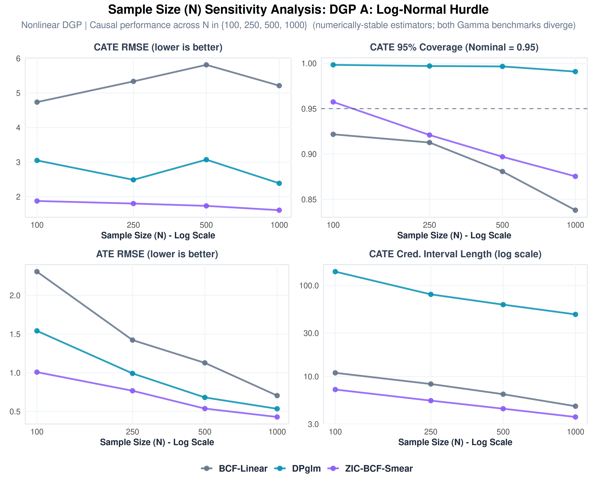
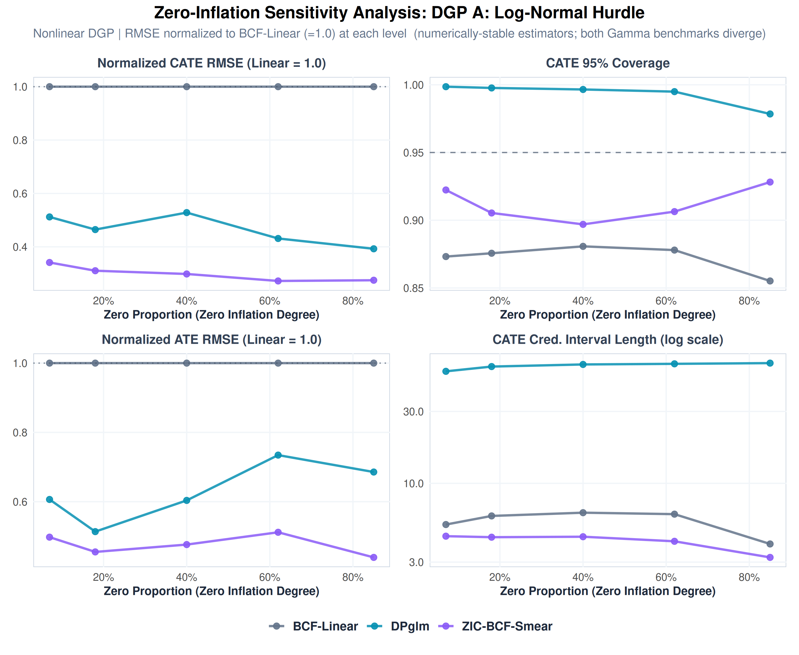

# Nonlinear-DGP Simulation Study: ZIC-BCF-Smear vs. Four Benchmark Estimators

This report presents a comparative analysis of the proposed **Zero-Inflated Continuous Bayesian Causal Forest with Duan's Smearing (ZIC-BCF-Smear)** against **four benchmark estimators** on a battery of **nonlinear** semicontinuous Data-Generating Processes (DGPs).

It is the paper-grade counterpart to the [main (link-linear) simulation study](../simulation_studies/simulation_studies_analysis.md): the same five estimators, the same three DGP families (A = Log-Normal hurdle, B = Gamma hurdle, C = Tweedie), the same sample-size ($N$) and zero-inflation (ZI) sensitivity grids, and **100 independent Monte Carlo seeds per scenario** — but with conditional-mean surfaces that are **nonlinear on the link scale** (cross terms, smooth `sin` nonlinearities, centered quadratics, and a nonlinear/interacted treatment effect; see [`nonlinear_dgps.R`](nonlinear_dgps.R) and [`README.md`](README.md)).

---

## 1. Motivation, Framework & Causal Targets

### The hypothesis under test
In the link-**linear** main study, the parametric **Gamma Hurdle** benchmark is surprisingly competitive because its `(1, z, X, z·X)` design is (near-)correctly specified for an affine truth. The conjecture — first checked in the 3-seed stress test of [`README.md`](README.md) §4–5 — is that this strength is a **linearity artefact**: once the conditional-mean surface is genuinely nonlinear, the fixed parametric design can no longer represent the heterogeneity, while a forest that splits on interactions and curvature can. This document tests that conjecture at **full 100-seed, full-grid scale** across all five estimators.

### Estimators compared
Semicontinuous causal inference targets the **Conditional Average Treatment Effect (CATE)** on the raw response scale:
$$\tau_{\text{resp}}(X_i) = E[Y_i(1) - Y_i(0) \mid X_i].$$
Because $Y_i \ge 0$ has a discrete mass at zero alongside a right-skewed positive part, five modeling philosophies are compared:

1. **BCF-Linear (Single-Part Gaussian)**: a Gaussian BCF fit directly on the raw semicontinuous outcome $Y_i$, ignoring the discrete spike at zero. The forest is nonlinear in $X$, but it never models the zero mass.
2. **DPglm (Bayesian Nonparametric)**: a Dirichlet-process mixture of zero-inflated regressions (Oganisian et al., 2021), the competing method in Kim, Li, Xu & Liao (2024). Within each latent cluster the outcome is a zero-inflated truncated-normal; the CATE follows by posterior-predictive G-computation.
3. **Gamma Hurdle (Parametric Two-Part)**: a logistic regression for $P(Y>0)$ and a Gamma log-link regression for $Y\mid Y>0$ (Oganisian, Mitra & Roy, 2019), both fit as weakly-informative Bayesian GLMs with a fully treatment-by-covariate interacted **linear** design `(1, z, X, z·X)`, combined by G-computation/standardization.
4. **Gamma +.01 (Naive Single-Part)**: the naive trick of adding $0.01$ to the zeros and fitting a single Gamma log-link regression to $Y+0.01$ (Oganisian et al., 2019).
5. **ZIC-BCF-Smear (Proposed, Two-Part)**: decouples the process into a **Hurdle Stage** (Probit BCF on the full sample for $P(Y_i > 0 \mid X_i, Z_i)$) and a **Continuous Intensity Stage** (Gaussian BCF on the active subpopulation $Y_i > 0$ for $\log(Y_i^+)$), re-transforming to the response scale via **Duan's Non-Parametric Smearing Estimator**.

All five share **byte-identical** DGP generators, seeds, and `calc_cate_metrics()`, so the numbers are directly comparable. Crucially, the two **Gamma** benchmarks (3 and 4) have only main effects + `z` + `z·X` in their column space; none of the nonlinear terms (`X1*X2`, `sin(c·X)`, `X²−1`, interacted treatment) are representable, so they are **genuinely misspecified** here.

### Nonlinear DGPs and zero-inflation calibration
The generators keep each family's positive-part distribution but replace the affine predictors with terms the link-linear design cannot represent. All nonlinear terms are mean-centered and the treatment effects are bounded (`sin`/`tanh`), so the outcome scale stays comparable to the linear study. The ZI grid `c_shift`s were recalibrated so each DGP hits a common set of realized zero proportions, with the **standard cell at ~40% zeros** for all three:

| ZI Level | DGP A | DGP B | DGP C |
| :--- | :---: | :---: | :---: |
| 1 | 85% | 85% | 85% |
| 2 | 62% | 61% | 60% |
| **3 (standard)** | **40%** | **40%** | **40%** |
| 4 | 18% | 18% | 11% |
| 5 | 7% | 5% | 3% |

*(DGP C's grid was shifted up so its standard sits at ~40% zeros, harmonized with A/B. A consequence — important when reading §4 — is that for DGP C the **absolute** response-scale effect grows as the zero proportion shrinks, so C's RMSE rises toward low ZI rather than high ZI.)*

---

## 2. Standard Comparative Results ($N = 500$, ZI Level 3, ~40% zeros)

Performance metrics compiled across 100 independent seeds at the standard configuration. The two parametric Gamma benchmarks **diverge numerically** on a minority of seeds (penalized-IRLS / G-computation overflow through the `exp()` link), so their **mean** RMSE is dominated by a handful of overflowing seeds and reads in the $10^7$–$10^{11}$ range. Those entries are marked **†** and are characterized properly in the **numerical-stability table** immediately below (divergence rate + divergence-robust median).

| DGP | Model | CATE RMSE | CATE 95% Cov | CATE Corr | CATE CI Length | ATE RMSE | ATE Abs Bias |
| :--- | :--- | :---: | :---: | :---: | :---: | :---: | :---: |
| **DGP A: Log-Normal** | BCF-Linear | 5.812 | 88.1% | 0.347 | 6.385 | 1.127 | 0.172 |
| | DPglm | 3.070 | 99.7% | 0.198 | 61.532 | 0.680 | **0.021** |
| | Gamma Hurdle | 9.7×10⁷ † | 69.2% | −0.039 | 5.8×10⁷ † | 5.6×10⁸ † | 5.9×10⁷ † |
| | Gamma +.01 | 3.0×10⁹ † | 69.5% | −0.081 | 2.1×10¹¹ † | 7.5×10⁸ † | 7.3×10⁷ † |
| | **ZIC-BCF-Smear** | **1.734** | 89.7% | **0.686** | **4.422** | **0.537** | 0.119 |
| **DGP B: Gamma** | BCF-Linear | 5.792 | 89.1% | 0.318 | 6.624 | 1.101 | 0.217 |
| | DPglm | 2.639 | 99.5% | 0.211 | 61.457 | 0.716 | 0.126 |
| | Gamma Hurdle | 1.7×10¹⁰ † | 74.1% | −0.040 | 1.5×10¹¹ † | 7.5×10¹⁰ † | 1.1×10¹⁰ † |
| | Gamma +.01 | 5.1×10⁸ † | 68.9% | −0.068 | 9.7×10⁸ † | 8.7×10⁸ † | 5.0×10⁷ † |
| | **ZIC-BCF-Smear** | **1.656** | 91.7% | **0.645** | **4.753** | **0.641** | **0.067** |
| **DGP C: Tweedie** | BCF-Linear | 0.302 | 91.6% | 0.060 | **0.638** | 0.111 | **0.026** |
| | DPglm | 0.404 | 99.9% | 0.022 | 37.874 | 0.114 | 0.058 |
| | Gamma Hurdle | 3.8×10¹⁰ † | 81.4% | −0.060 | 1.7×10¹¹ † | 6.3×10¹⁰ † | 7.8×10⁹ † |
| | Gamma +.01 | 1.9×10¹⁰ † | 76.3% | −0.045 | 2.2×10¹¹ † | 1.2×10¹¹ † | 1.2×10¹⁰ † |
| | **ZIC-BCF-Smear** | **0.250** | 94.6% | **0.175** | 0.704 | **0.101** | 0.030 |

### Numerical stability of the parametric benchmarks (standard cell)
Because the mean is uninformative for a diverging estimator, the table below reports the **divergence rate** (seeds whose per-seed CATE RMSE overflows the $O(1\text{–}6)$ true-CATE scale, threshold $>100$) and the **divergence-robust median** CATE RMSE — the typical, non-pathological performance:

| DGP | Model | Diverged | CATE RMSE (median) | ATE Abs Err (median) | CATE Corr |
| :--- | :--- | :---: | :---: | :---: | :---: |
| **DGP A** | Gamma Hurdle | 4 / 100 | 3.960 | 0.759 | **−0.039** |
| | Gamma +.01 | 5 / 100 | 4.336 | 0.747 | **−0.081** |
| | *ZIC-BCF-Smear* | *0 / 100* | *1.611* | *0.352* | *0.686* |
| **DGP B** | Gamma Hurdle | 5 / 100 | 3.704 | 0.784 | **−0.040** |
| | Gamma +.01 | 9 / 100 | 4.145 | 0.692 | **−0.068** |
| | *ZIC-BCF-Smear* | *0 / 100* | *1.537* | *0.494* | *0.645* |
| **DGP C** | Gamma Hurdle | 5 / 100 | 0.369 | 0.122 | **−0.060** |
| | Gamma +.01 | 7 / 100 | 0.460 | 0.147 | **−0.045** |
| | *ZIC-BCF-Smear* | *0 / 100* | *0.188* | *0.065* | *0.175* |

### Key Empirical Findings

1. **The parametric Gamma benchmarks break down on nonlinear DGPs in two simultaneous ways.** (i) **Numerical instability** — they overflow on 4–9% of seeds, inflating their *mean* RMSE to $10^7$–$10^{11}$; this is the link-`exp()` overflow that the naive Gamma +.01 is already known for (Oganisian et al.), and the misspecified Gamma Hurdle now exhibits it too. (ii) **Wrong heterogeneity** — even on the robust *median*, their CATE correlation is **negative** in every DGP (−0.04 to −0.08): the fixed linear design ranks units' treatment effects in roughly the *wrong order*. This is exactly the failure the [`README.md`](README.md) conjecture predicted, now confirmed at 100-seed scale.

2. **ZIC-BCF-Smear is the best CATE estimator in every DGP — decisively.** Its CATE RMSE (**1.734 / 1.656 / 0.250**) is the lowest of all five, and even comparing *robust median to robust median* it is ~2.4–2.7× better than the Gamma benchmarks in A/B and ~2.0–2.5× better in C. Its CATE correlation (**0.686 / 0.645 / 0.175**) is positive and far ahead of every benchmark — it recovers the *order* of individual effects, which nonlinearity stresses hardest.

3. **ZIC-BCF-Smear also wins the ATE in all three DGPs** (0.537 / 0.641 / 0.101). In the link-linear study the ATE was the Gamma Hurdle's refuge (its G-computation was near-unbiased under correct specification); under nonlinearity that refuge closes — the parametric ATE error is dominated by the same divergence, and even its robust median ATE error exceeds Smear's.

4. **DPglm attains middling point error but pathologically over-wide intervals.** Its credible intervals are an **order of magnitude too wide** (CI length ≈ 61 in A/B, ≈ 38 in C vs. ZIC-BCF-Smear's 0.7–4.8), pinning coverage at a degenerate **99.5–99.9%**. As in the linear study, DPglm is numerically stable (0 diverged seeds) but unusable for calibrated uncertainty quantification.

5. **BCF-Linear is stable but the weakest on CATE under hurdle skew** (CATE RMSE ≈ 5.8 in A/B, correlation ≈ 0.3, coverage 88–89%). Ignoring the zero mass leaves its posterior contracting around a biased single-part target.

---

## 3. Sample Size ($N$) Sensitivity Analysis ($N \in \{100, 250, 500, 1000\}$)

How the estimators scale with $N$ under standard (~40%) zero-inflation. Each DGP is visualized in a 2×2 grid (CATE RMSE, CATE 95% Coverage, ATE RMSE, CATE Credible Interval Length on a log axis). Aggregated metrics (means, medians, divergence rates): [`results/n_sensitivity_summary.csv`](results/n_sensitivity_summary.csv).

> **Two figure variants per DGP.** The full five-model figures (`n_sensitivity_dgp_*.png`) are swamped because **both** Gamma benchmarks diverge — their mean RMSE reaches ~$10^{13}$ and flattens every other line to zero. The legible **`_stable`** figures drop the two diverging parametric benchmarks, leaving the three numerically-stable estimators. *(This is stronger than the linear study's `_no_gp01` variant, where only Gamma +.01 diverged.)*

**DGP A (stable estimators):**

*(Companion legible figures: [`n_sensitivity_dgp_b_stable.png`](results/n_sensitivity_dgp_b_stable.png), [`n_sensitivity_dgp_c_stable.png`](results/n_sensitivity_dgp_c_stable.png); full five-model versions: [`n_sensitivity_dgp_a.png`](results/n_sensitivity_dgp_a.png), [`_b`](results/n_sensitivity_dgp_b.png), [`_c`](results/n_sensitivity_dgp_c.png).)*

### Parametric benchmarks across the N-grid
The instability is **not** a small-$N$ artefact: the Gamma benchmarks diverge in **23 of 24** N-sensitivity cells (Gamma Hurdle on a mean 2.4% of seeds, Gamma +.01 on 6.2%, up to 10%), and their CATE correlation stays ≈ 0 or negative at every sample size (grid median **−0.051**; ranges −0.076…0.015 for Gamma Hurdle, −0.098…0.035 for Gamma +.01). More data does not help a model that cannot represent the heterogeneity.

### Credible Interval Length and CATE RMSE (stable estimators)
* **ZIC-BCF-Smear** has the lowest CATE RMSE at every $N$ in all three DGPs, and contracts its intervals systematically (DGP A: $7.18 \rightarrow 5.43 \rightarrow 4.42 \rightarrow 3.59$; DGP B: $7.94 \rightarrow 5.66 \rightarrow 4.75 \rightarrow 3.89$). Its CATE correlation *rises* with $N$ (DGP A: $0.569 \rightarrow 0.664 \rightarrow 0.686 \rightarrow 0.721$).
* **DPglm** contracts but stays an order of magnitude wider (DGP A: $141.8 \rightarrow 79.8 \rightarrow 61.5 \rightarrow 48.1$), coverage pinned near 100%.
* **BCF-Linear** CATE RMSE stays high and roughly flat (~5–6 in A/B); more data cannot fix the structural blur of the zero mass.

### CATE Coverage as $N$ Scales (stable estimators)
| DGP | Model | N = 100 | N = 250 | N = 500 | N = 1000 |
| :--- | :--- | :---: | :---: | :---: | :---: |
| **DGP A** | BCF-Linear | 92.2% | 91.3% | 88.1% | **83.8%** |
| | DPglm | 99.8% | 99.7% | 99.7% | **99.1%** |
| | **ZIC-BCF-Smear** | 95.7% | 92.1% | 89.7% | **87.5%** |
| **DGP B** | BCF-Linear | 93.3% | 89.9% | 89.1% | **84.5%** |
| | DPglm | 99.9% | 99.8% | 99.5% | **99.2%** |
| | **ZIC-BCF-Smear** | 96.1% | 93.8% | 91.7% | **90.6%** |
| **DGP C** | BCF-Linear | 94.9% | 93.6% | 91.6% | **89.5%** |
| | DPglm | 100.0% | 99.9% | 99.9% | **99.9%** |
| | **ZIC-BCF-Smear** | 97.4% | 96.1% | 94.6% | **92.3%** |

*(Gamma benchmarks omitted from this coverage table: their nominal-looking coverage of 58–90% is not comparable, since it is computed around diverged point estimates.)* ZIC-BCF-Smear holds the closest-to-nominal coverage of the stable estimators (on target in DGP C); its mild under-coverage in A/B at large $N$ is the expected cost of a harder nonlinear mean surface, far better calibrated than BCF-Linear (sliding to 84%) and never degenerate like DPglm.

---

## 4. Zero-Inflation (ZI) Sensitivity Analysis (Zero Proportions 3%–85%)

Varying the hurdle intercept yields realized zero proportions from **3% to 85%** at fixed $N = 500$. Results are in 2×2 grids (Normalized CATE RMSE, CATE Coverage, Normalized ATE RMSE, CATE CI Length). Aggregated metrics: [`results/zi_sensitivity_summary.csv`](results/zi_sensitivity_summary.csv). RMSE is normalized to BCF-Linear (= 1.0) at each level. As in §3, the `_stable` figures (three stable estimators) are the legible primary; the full five-model figures are swamped by Gamma divergence.

**DGP A (stable estimators):**

*(Companion legible figures: [`zi_sensitivity_dgp_b_stable.png`](results/zi_sensitivity_dgp_b_stable.png), [`zi_sensitivity_dgp_c_stable.png`](results/zi_sensitivity_dgp_c_stable.png); full five-model versions: [`zi_sensitivity_dgp_a.png`](results/zi_sensitivity_dgp_a.png), [`_b`](results/zi_sensitivity_dgp_b.png), [`_c`](results/zi_sensitivity_dgp_c.png).)*

### Parametric benchmarks across the ZI-grid
Divergence persists and worsens toward the extremes: the Gamma benchmarks diverge in **28 of 30** ZI cells, with Gamma +.01 overflowing up to **26%** of seeds at the hardest level. Their CATE correlation is again ≈ 0/negative throughout (grid median **−0.044**), reaching **−0.20** at low zero-inflation in DGPs A/B — i.e., the misspecified design's wrong-ranking is *most* severe exactly where the continuous part carries the most signal.

### Normalized CATE RMSE (BCF-Linear = 1.0), stable estimators
ZIC-BCF-Smear sits well below the single-part baseline at **every** zero-inflation level in **every** DGP:

| Zero Proportion (ZI Level) | DGP A | DGP B | DGP C |
| :--- | :---: | :---: | :---: |
| **~85% (Level 1)** | **0.275** | **0.274** | **0.394** |
| **~60%–62% (Level 2)** | 0.272 | 0.280 | 0.653 |
| **~40% (Level 3)** | 0.298 | 0.286 | 0.830 |
| **~11%–18% (Level 4)** | 0.311 | 0.305 | 0.859 |
| **~3%–7% (Level 5)** | 0.341 | 0.298 | 0.831 |

In the hurdle DGPs (A, B) the advantage is largest under heavy zero-inflation: at 85% zeros (DGP A) ZIC-BCF-Smear's CATE RMSE is just **27.5%** of BCF-Linear's, because the continuous forest is fit only on the (now small) active subpopulation and is never asked to resolve the zero mass.

### Benchmark Behaviour at Extreme Zero-Inflation (ZI Level 1, ~85% zeros)
Among the stable estimators, DPglm separates most sharply at the extreme. Normalized CATE RMSE (BCF-Linear = 1.0):

| Model | DGP A | DGP B | DGP C |
| :--- | :---: | :---: | :---: |
| **ZIC-BCF-Smear** | **0.275** | **0.274** | **0.394** |
| DPglm | 0.393 | 0.393 | **14.424** |

* **ZIC-BCF-Smear dominates at extreme zero-inflation** in all three DGPs (normalized CATE RMSE ≈ 0.27–0.39). With only ~15% positive observations, fitting the continuous stage strictly on the active subpopulation keeps point error low and intervals adaptive.
* **DPglm collapses in Tweedie at 85% zeros** (normalized CATE RMSE **14.4** — fourteen times *worse* than the linear baseline): when the active fraction is tiny, its latent imputation of the zeros becomes almost pure augmentation noise. (In the hurdle DGPs A/B it stays competitive at ~0.39.)

### The DGP C scale inversion
Because DGP C's `c_shift` grid was shifted to put its standard at 40% zeros, its **absolute** response-scale effect *grows* as the zero proportion *shrinks* (opposite to A/B). Both BCF-Linear and DPglm blow up toward low ZI — at 3% zeros BCF-Linear CATE RMSE is 6.443 and DPglm 6.837 — whereas ZIC-BCF-Smear remains the lowest (5.355) and best-calibrated. Across the entire ZI range of all three DGPs, ZIC-BCF-Smear is never beaten on CATE RMSE by any stable estimator.

---

## 5. Interpretation & Mathematical Rationale

The nonlinear grid confirms the rationales in [ZICBCF_Model_Explanation.md](../ZICBCF_Model_Explanation.md), and sharpens *why each estimator behaves as it does once the truth is nonlinear*.

### Why the parametric benchmarks fail — the README hypothesis, confirmed at scale
The Gamma Hurdle and Gamma +.01 designs span only `(1, z, X, z·X)`. The nonlinear DGPs add cross terms, `sin`, centered quadratics, and an interacted treatment effect — none in that column space. Two consequences follow, both observed:
* **Wrong heterogeneity (bias in the *direction* of the CATE).** The best linear approximation to a nonlinear surface does not preserve the ordering of per-unit effects, so the CATE correlation goes **negative** (−0.04 to −0.20). A global average (ATE) tolerates this; per-unit heterogeneity (CATE) does not — exactly the "ATE recoverable, CATE not" intuition, here pushed until even the ATE is lost to instability.
* **Numerical divergence.** A misspecified linear predictor pushed through the Gamma `exp()` link produces extreme fitted means on tail covariate combinations; the penalized-IRLS / G-computation then overflows on a subset of seeds (4–9% standard, up to 26% at extreme ZI). This is the same quasi-separation mechanism that makes Gamma +.01 notorious, now triggered in the hurdle model too.

### Rationale A: Active-Subset Fitting Prevents Augmentation Noise
DPglm's mixture imputes latent continuous values for the zero observations. Under heavy zero-inflation a large fraction of the continuous "signal" is simulated noise, inflating variance and producing over-wide posteriors — DPglm's failure mode (CI length ≈ 40–60, ~100% coverage, the 14× CATE-RMSE blow-up in Tweedie at 85% zeros). Fitting the continuous BCF strictly on the active subpopulation ($Y_i > 0$) bypasses this entirely.

### Rationale B: Subpopulation Propensity Adjustment (SPA) Isolates Confounding
Conditioning on active observations introduces selection (collider) bias, since participation depends on treatment and covariates. ZIC-BCF-Smear estimates the active-subset propensity $\widehat{\pi}_i^+$ and includes it as a control covariate in the continuous forest — which matters *more*, not less, when participation is a nonlinear function of $X$.

### Rationale C: Duan's Non-Parametric Smearing Re-transformation
For right-skewed positive intensities (log-normal in A, Gamma in B, compound Poisson-Gamma in C), parametric re-transformation via $\exp(\sigma_c^2/2)$ is fragile. Duan's smearing factor $\phi_{\text{smear}} = \frac{1}{N_{\text{active}}}\sum \exp(e_j)$ calibrates the scale adjustment directly from empirical residuals, so the response-scale CATE stays accurate without assuming the positive-part family — and, combined with two forests, lets the proposed estimator track a nonlinear mean surface that no fixed parametric design can represent and that BCF-Linear/DPglm cannot resolve through the zero mass.

---

## 6. Conclusion

On a paper-grade (100-seed) battery of **nonlinear** semicontinuous DGPs, across the full sample-size and zero-inflation grids, **ZIC-BCF-Smear is the best-performing estimator on essentially every axis**, and the apparent strength of the parametric benchmarks in the linear study is shown to be a **linearity artefact**:

- It delivers the **lowest CATE RMSE in all three DGPs and at every $N$ and every zero-inflation level** — and the highest CATE correlation throughout (positive 0.18–0.72), where every benchmark sits near zero or negative. It recovers the *heterogeneity*, not just its average.
- Under nonlinearity it now also wins the **ATE** in all three DGPs, closing the ATE "refuge" the Gamma Hurdle enjoyed in the linear study.
- It is the only estimator that is simultaneously **numerically robust** (0 diverged seeds across the entire grid) and **well-calibrated** (≈ 90–98% coverage, adaptive width) — in stark contrast to the **Gamma benchmarks**, which diverge on 4–26% of seeds and rank heterogeneity in the wrong order (negative CATE correlation), and to **DPglm**, which is stable but degenerate (~100% over-coverage, order-of-magnitude-wider intervals, and a 14× CATE-RMSE blow-up at 85% zeros in Tweedie).

Read alongside the [main linear study](../simulation_studies/simulation_studies_analysis.md), the message is unified: the parametric Gamma benchmarks look competitive **only** when the conditional-mean surface is (close to) linear on the link scale. As soon as the heterogeneity is a genuinely nonlinear function of the covariates, those designs recover the wrong heterogeneity *and* destabilize numerically, the single-part and mixture forests blur or over-smooth the zero mass, and the proposed **ZIC-BCF-Smear** — by decoupling the zero-inflation hurdle from the continuous positive intensity, adjusting for subpopulation confounding, and applying Duan's non-parametric smearing re-transformation — dominates on CATE precision, ranking, calibration, and ATE alike, **without committing to a parametric outcome model**.
